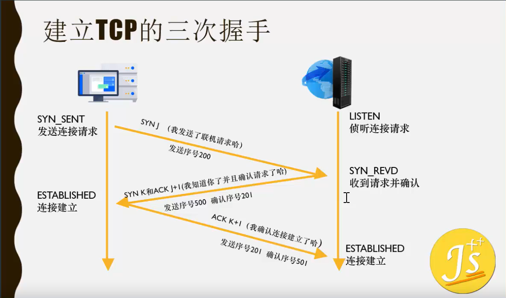
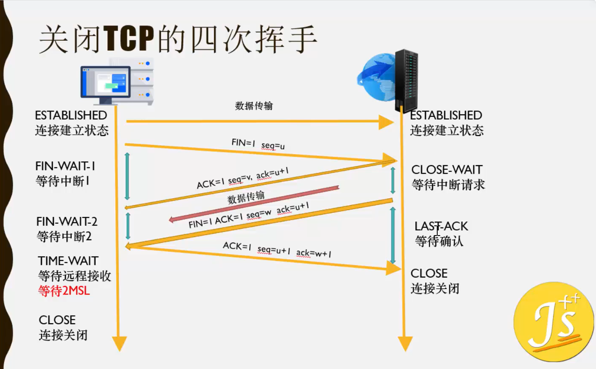

<<<<<<< HEAD
# 三次握手和四次挥手

- 网络请求（三次握手和四次挥手）在***传输层***，位于tcp/ip协议的第二层。
    > tcp/ip的四层协议：
      
        1. 应用层（各种应用层协议TELNET，FTP，SMTP等）
        2. 传输层（TCP或UDP）
        3. 网络层IP
        4. 网络接口层（数据链路层和物理层-五层协议）
        
    > OSI的七层协议虽然理论完整，但是复杂不实用

    运输层都是处于中间

- 建立TCP的**三次握手**
    
        SYN同步请求，J序列号

- 关闭TCP的**四次挥手**
    
    > 为什么要等待2MSL？可能会存在最后一个确认码ACK，服务端没有收到的情况，那么服务端还是会发请求码FIN，如果客户端收到了，接着发确认码ACK，然后继续等，直到2MSL中服务端没有发送任何请求，最后才关闭连接。

=======
# 三次握手和四次挥手

- 网络请求（三次握手和四次挥手）在***传输层***，位于tcp/ip协议的第二层。
    > tcp/ip的四层协议：
      
        1. 应用层（各种应用层协议TELNET，FTP，SMTP等）
        2. 传输层（TCP或UDP）
        3. 网络层IP
        4. 网络接口层（数据链路层和物理层-五层协议）
        
    > OSI的七层协议虽然理论完整，但是复杂不实用

    运输层都是处于中间

- 建立TCP的**三次握手**
    
        SYN同步请求，J序列号

- 关闭TCP的**四次挥手**
    
    > 为什么要等待2MSL？可能会存在最后一个确认码ACK，服务端没有收到的情况，那么服务端还是会发请求码FIN，如果客户端收到了，接着发确认码ACK，然后继续等，直到2MSL中服务端没有发送任何请求，最后才关闭连接。

>>>>>>> 3060b42 (第一次Git提交所有文件)
