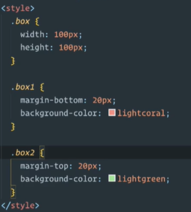
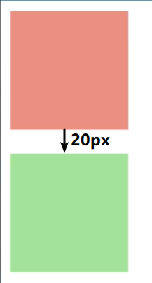
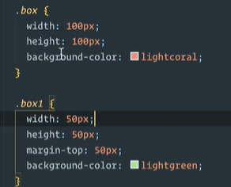
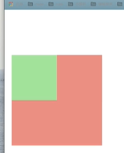

<<<<<<< HEAD
## BFC

- Block Formatting Context， 名为 "块级格式化上下文"。

- W3C官方解释为：BFC它决定了元素如何对其内容进行定位，以及与其它元素的关系和相互作用，当涉及到可视化布局时，Block Formatting Context提供了一个环境，HTML在这个环境中按照一定的规则进行布局。

- BFC是一个**完全独立的空间**（布局环境），让空间里的**子元素不会影响到外面的布局**。BFC可以看做是一个CSS元素属性。

## 触发BFC

    1. overflow: hidden | scroll | auto  不是visible
    2. display: inline-block | table-cell | flex | table-caption | grid  不是block，nono,inline
    3. position: absolute | fixed   不是relative
    4. float: left | right
    5. body: BFC元素
    

## BFC的规则

    1. BFC就是一个块级元素，块级元素会在垂直方向一个接一个的排列
    2. BFC就是页面中的一个隔离的独立容器，容器里的标签不会影响到外部标签
    3. 垂直方向的距离由margin决定， 属于同一个BFC的两个相邻的标签外边距会发生重叠
    4. 计算BFC的高度时，浮动元素也参与计算

## 问题

1. margin重合

    > class="box box1"
    
    

    - 俩个方块本应该相隔40px，但只有20px，俩个box的margin重合。

    - 解决方法：添加一个父容器，使其BFC。

2. margin塌陷

    > box是box1的父容器
    
    

    - box1应该和父容器顶相距50px，但是拉着和父容器一起离网页顶部相距50px。

    - 解决方法：使父容器BFC。或者父容器添加一个参照物也可以（border-top:1px solid #000）

3. 高度坍塌

    
    

    - box1本应该把box撑开，但是box的高度坍塌了，子元素还在。（子元素浮动布局对父级造成影响）

    - 解决方法：使父容器BFC。

=======
## BFC

- Block Formatting Context， 名为 "块级格式化上下文"。

- W3C官方解释为：BFC它决定了元素如何对其内容进行定位，以及与其它元素的关系和相互作用，当涉及到可视化布局时，Block Formatting Context提供了一个环境，HTML在这个环境中按照一定的规则进行布局。

- BFC是一个**完全独立的空间**（布局环境），让空间里的**子元素不会影响到外面的布局**。BFC可以看做是一个CSS元素属性。

## 触发BFC

    1. overflow: hidden | scroll | auto  不是visible
    2. display: inline-block | table-cell | flex | table-caption | grid  不是block，nono,inline
    3. position: absolute | fixed   不是relative
    4. float: left | right
    5. body: BFC元素
    

## BFC的规则

    1. BFC就是一个块级元素，块级元素会在垂直方向一个接一个的排列
    2. BFC就是页面中的一个隔离的独立容器，容器里的标签不会影响到外部标签
    3. 垂直方向的距离由margin决定， 属于同一个BFC的两个相邻的标签外边距会发生重叠
    4. 计算BFC的高度时，浮动元素也参与计算

## 问题

1. margin重合

    > class="box box1"
    
    

    - 俩个方块本应该相隔40px，但只有20px，俩个box的margin重合。

    - 解决方法：添加一个父容器，使其BFC。

2. margin塌陷

    > box是box1的父容器
    
    

    - box1应该和父容器顶相距50px，但是拉着和父容器一起离网页顶部相距50px。

    - 解决方法：使父容器BFC。或者父容器添加一个参照物也可以（border-top:1px solid #000）

3. 高度坍塌

    
    

    - box1本应该把box撑开，但是box的高度坍塌了，子元素还在。（子元素浮动布局对父级造成影响）

    - 解决方法：使父容器BFC。

>>>>>>> 3060b42 (第一次Git提交所有文件)
- overflow:hidden最合适，其他的多多少少会影响布局。