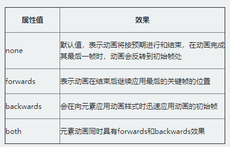

<<<<<<< HEAD
# 动画 animation


- -webkit 是表示针对Chrome浏览器和 safari 浏览器支持，-ms表示针对 IE 浏览器支持。-moz是表示对Firefox浏览器支持。


## 9.1 CSS3 Keyframes 关键帧

- 在CSS3中其主要以“***@keyframes***”开头，后面紧跟着是动画名称加上一对花括号“{…}”，括号中就是一些不同时间段样式规则。
    ```
    @keyframes wobble {
        0% {
            margin-left: 100px;
            background:green;
        }
        40% {
            margin-left:150px;
            background:orange;
        }
        60% {
            margin-left: 75px;
            background: blue;
        }
        100% {
            margin-left: 100px;
            background: red;
        }
    }
    ```

## 9.2 CSS3 animation-name 调用动画

- animation-name属性主要是用来调用 @keyframes 定义好的动画。
    > 需要特别注意: animation-name 调用的动画名需要和“@keyframes”定义的动画名称完全一致（区分大小写），如果不一致将不具有任何动画效果。


## 9.3 CSS3 animation-duration 设置动画播放时间

- animation-duration主要用来设置CSS3动画播放时间，其使用方法和transition-duration类似，是用来指定元素播放动画所持续的时间长，也就是完成从0%到100%一次动画所需时间。
    > 如果值为负值会被视为“0”,就是没有动画效果。


## 9.4 CSS3 animation-timing-function 设置动画播放方式

- animation-timing-function属性主要用来设置动画播放方式。
    


## 9.5 CSS3 animation-delay 设置动画开始播放的时间

- animation-delay属性用来定义动画开始播放的时间，用来触发动画播放的时间点。

## 9.6 CSS3 animation-iteration-count 设置动画播放次数

- animation-iteration-count属性主要用来定义动画的播放次数。
    > 其值通常为整数，但也可以使用带有小数的数字.
    > 如果取值为***infinite***，动画将会无限次的播放。


## 9.7 CSS3 animation-direction 设置动画播放方向

- animation-direction属性主要用来设置动画播放方向.
    1. normal是默认值，动画的每次循环都是向前播放；
    2. alternate，动画播放在第偶数次向前播放，第奇数次向反方向播放。


## 9.8 CSS3 animation-play-state 设置动画的播放状态

- animation-play-state属性主要用来控制元素动画的播放状态。
    1. running是其默认值，播放
    2. paused将正在播放的动画停下来
    > 如果暂停了动画的播放，元素的样式将回到最原始设置状态。


## 9.9 CSS3 animation-fill-mode 设置动画时间外属性

- animation-fill-mode属性定义在动画开始之前和结束之后发生的操作。主要具有四个属性值：none、forwards、backwords和both。
    

=======
# 动画 animation


- -webkit 是表示针对Chrome浏览器和 safari 浏览器支持，-ms表示针对 IE 浏览器支持。-moz是表示对Firefox浏览器支持。


## Keyframes 关键帧

- 在CSS3中其主要以“***@keyframes***”开头，后面紧跟着是动画名称加上一对花括号“{…}”，括号中就是一些不同时间段样式规则。
    ```
    @keyframes wobble {
        0% {
            margin-left: 100px;
            background:green;
        }
        40% {
            margin-left:150px;
            background:orange;
        }
        60% {
            margin-left: 75px;
            background: blue;
        }
        100% {
            margin-left: 100px;
            background: red;
        }
    }
    ```

## animation-name 调用动画

- animation-name属性主要是用来调用 @keyframes 定义好的动画。
    > 需要特别注意: animation-name 调用的动画名需要和“@keyframes”定义的动画名称完全一致（区分大小写），如果不一致将不具有任何动画效果。


## animation-duration 设置动画播放时间

- animation-duration主要用来设置CSS3动画播放时间，其使用方法和transition-duration类似，是用来指定元素播放动画所持续的时间长，也就是完成从0%到100%一次动画所需时间。
    > 如果值为负值会被视为“0”,就是没有动画效果。


## animation-timing-function 设置动画播放方式

- animation-timing-function属性主要用来设置动画播放方式。
    


## animation-delay 设置动画开始播放的时间

- animation-delay属性用来定义动画开始播放的时间，用来触发动画播放的时间点。

## animation-iteration-count 设置动画播放次数

- animation-iteration-count属性主要用来定义动画的播放次数。
    > 其值通常为整数，但也可以使用带有小数的数字.
    > 如果取值为***infinite***，动画将会无限次的播放。


## animation-direction 设置动画播放方向

- animation-direction属性主要用来设置动画播放方向.
    1. normal是默认值，动画的每次循环都是向前播放；
    2. alternate，动画播放在第偶数次向前播放，第奇数次向反方向播放。


## animation-play-state 设置动画的播放状态

- animation-play-state属性主要用来控制元素动画的播放状态。
    1. running是其默认值，播放
    2. paused将正在播放的动画停下来
    > 如果暂停了动画的播放，元素的样式将回到最原始设置状态。


## animation-fill-mode 设置动画时间外属性

- animation-fill-mode属性定义在动画开始之前和结束之后发生的操作。主要具有四个属性值：none、forwards、backwords和both。
    

>>>>>>> 3060b42 (第一次Git提交所有文件)
