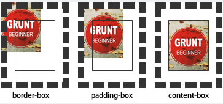
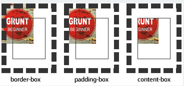

<<<<<<< HEAD
# 背景相关

## 5.1 CSS3背景 background-origin

- 设置元素背景图片的***原始起始位置***
    ```
    background-origin ： border-box | padding-box | content-box;
    ```
    - 分别表示背景图片是从,边框，内边距（默认值），或者是内容区域,开始显示。  
    
    
       > 如果背景background不是no-repeat，这个属性无效，它会从边框开始显示。

## 5.2 CSS3背景 background-clip

- 用来将背景图片做适当的***裁剪***以适应实际需要
    ```
    background-clip ： border-box | padding-box | content-box | no-clip ;
    ```
    - 边框、内填充，或者内容区域向外裁剪背景。no-clip表示不裁切，和参数border-box显示同样的效果,默认值为**border-box**。  
    

## 5.3 CSS3背景 background-size

- 设置背景图片的大小，以长度值或百分比显示，还可以通过**cover和contain**来对图片进行伸缩。
    ```
    background-size: auto | <长度值> | <百分比> | cover | contain ;
    ```
    1. auto：默认值，不改变背景图片的原始高度和宽度；
    2. <长度值>：成对出现如200px 50px，将背景图片宽高依次设置为前面两个值，当设置一个值时，将其作为图片宽度值来等比缩放；

    3. <百分比>：0％~100％之间的任何值，将背景图片宽高依次设置为所在元素宽高乘以前面百分比得出的数值，当设置一个值时同上；

    4. cover：顾名思义为覆盖，即将背景图片等比缩放以填满整个容器；

    5. contain：容纳，即将背景图片等比缩放至某一边紧贴容器边缘为止。

## 5.4 CSS3背景 multiple backgrounds

- 多重背景，也就是CSS2里background的属性外加***origin、clip和size***组成的新background的多次叠加，缩写时为用逗号隔开的每组值；用分解写法时，如果有多个背景图片，而其他属性只有一个，表明所有背景图片应用该属性值。
    ```
    background ： [background-color] | [background-image] | [background-position][/background-size] | [background-repeat] | [background-attachment] | [background-clip] | [background-origin],...
    ```
    > 1. 如果有 size 值，需要紧跟 position 并且用 "/" 隔开；
    > 2. background-color 只能设置一个。


## 伪元素
- 伪元素的由两个冒号::开头，然后是伪元素的名称 。


    :first-letter	向文本的第一个字母添加特殊样式。	1  
    :first-line	向文本的首行添加特殊样式。	1  
    :before	在元素之前添加内容。	2  
    :after	在元素之后添加内容。	2  

- 伪类由一个冒号:开头，冒号后面是伪类的名称和包含在圆括号中的可选参数。


    :active	向被激活的元素添加样式。	1  
    :focus	向拥有键盘输入焦点的元素添加样式。	2  
    :hover	当鼠标悬浮在元素上方时，向元素添加样式。	1  
    :link	向未被访问的链接添加样式。	1  
    :visited	向已被访问的链接添加样式。	1  
    :first-child	向元素的第一个子元素添加样式。	2  
    :lang	向带有指定 lang 属性的元素添加样式。	2  


=======
# 背景相关

## 5.1 CSS3背景 background-origin

- 设置元素背景图片的***原始起始位置***
    ```
    background-origin ： border-box | padding-box | content-box;
    ```
    - 分别表示背景图片是从,边框，内边距（默认值），或者是内容区域,开始显示。  
    
    
       > 如果背景background不是no-repeat，这个属性无效，它会从边框开始显示。

## 5.2 CSS3背景 background-clip

- 用来将背景图片做适当的***裁剪***以适应实际需要
    ```
    background-clip ： border-box | padding-box | content-box | no-clip ;
    ```
    - 边框、内填充，或者内容区域向外裁剪背景。no-clip表示不裁切，和参数border-box显示同样的效果,默认值为**border-box**。  
    

## 5.3 CSS3背景 background-size

- 设置背景图片的大小，以长度值或百分比显示，还可以通过**cover和contain**来对图片进行伸缩。
    ```
    background-size: auto | <长度值> | <百分比> | cover | contain ;
    ```
    1. auto：默认值，不改变背景图片的原始高度和宽度；
    2. <长度值>：成对出现如200px 50px，将背景图片宽高依次设置为前面两个值，当设置一个值时，将其作为图片宽度值来等比缩放；

    3. <百分比>：0％~100％之间的任何值，将背景图片宽高依次设置为所在元素宽高乘以前面百分比得出的数值，当设置一个值时同上；

    4. cover：顾名思义为覆盖，即将背景图片等比缩放以填满整个容器；

    5. contain：容纳，即将背景图片等比缩放至某一边紧贴容器边缘为止。

## 5.4 CSS3背景 multiple backgrounds

- 多重背景，也就是CSS2里background的属性外加***origin、clip和size***组成的新background的多次叠加，缩写时为用逗号隔开的每组值；用分解写法时，如果有多个背景图片，而其他属性只有一个，表明所有背景图片应用该属性值。
    ```
    background ： [background-color] | [background-image] | [background-position][/background-size] | [background-repeat] | [background-attachment] | [background-clip] | [background-origin],...
    ```
    > 1. 如果有 size 值，需要紧跟 position 并且用 "/" 隔开；
    > 2. background-color 只能设置一个。


## 伪元素
- 伪元素的由两个冒号::开头，然后是伪元素的名称 。


    :first-letter	向文本的第一个字母添加特殊样式。	1  
    :first-line	向文本的首行添加特殊样式。	1  
    :before	在元素之前添加内容。	2  
    :after	在元素之后添加内容。	2  

- 伪类由一个冒号:开头，冒号后面是伪类的名称和包含在圆括号中的可选参数。


    :active	向被激活的元素添加样式。	1  
    :focus	向拥有键盘输入焦点的元素添加样式。	2  
    :hover	当鼠标悬浮在元素上方时，向元素添加样式。	1  
    :link	向未被访问的链接添加样式。	1  
    :visited	向已被访问的链接添加样式。	1  
    :first-child	向元素的第一个子元素添加样式。	2  
    :lang	向带有指定 lang 属性的元素添加样式。	2  


>>>>>>> 3060b42 (第一次Git提交所有文件)
