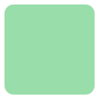
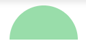
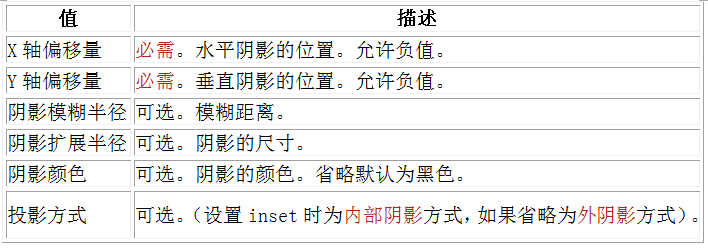
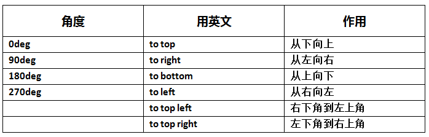

<<<<<<< HEAD
# 边框 颜色 文字字体

## 2.1 CSS3边框 圆角效果 border-radius

### *border-radius是向元素添加圆角边框*
- border-radius:10px;   所有角都使用半径为10px的圆角    


- border-radius: 5px 4px 3px 2px;  
   ***四个半径值分别是左上角、右上角、右下角和左下角，顺时针***  
  
    > 还可以用百分比或者em，但兼容性目前还不太好!

- 实心上半圆
```
div{
    height:50px;  /*是width的一半*/
    width:100px;
    background:#9da;
    border-radius:50px 50px 0 0;  /*半径至少设置为height的值*/
    }
```


## 2.2 CSS3边框 阴影 box-shadow

### *box-shadow是向盒子添加阴影。支持添加一个或者多个*
- box-shadow: X轴偏移量 Y轴偏移量 [阴影模糊半径] [阴影扩展半径] [阴影颜色] [投影方式]



> 1. inset 可以写在参数的第一个或最后一个，其它位置是无效的  
> 2. 阴影扩展半径：可以是正负值，如果值为正，则整个阴影都延展扩大，反之值为负值时，则缩小  
> 3. 阴影模糊半径：只能是为正值，如果其值为0时，表示阴影不具有模糊效果，其值越大阴影的边缘就越模糊  
> 4. x轴，为负数时，左下为阴影
> 5. y轴，为负数时，右上为阴影


## 2.3 CSS3边框 为边框应用图片 border-image

### *边框应用背景图片*
- border-image  


## 3.1 CSS3颜色 颜色之RGBA

### *RGBA是在RGB的基础上增加了控制alpha透明度的参数*
- color：rgba(R,G,B,A)
    > A为透明度参数，取值在0~1之间，不可为负值。


## 3.2 CSS3颜色 渐变色彩 

- CSS3 Gradient 分为线性渐变(linear)和径向渐变(radial)。由于不同的渲染引擎实现渐变的语法不同，这里只针对线性渐变的 W3C 标准语法来分析其用法  
  
- 参数：  
    1. 指定渐变方向  
      
    第一个参数省略时，默认为“180deg”，等同于“to bottom”。

    2. 第二个和第三个参数，表示**颜色的起始点和结束点**，可以有多个颜色值。  
    ``` 
    background-image:linear-gradient(to left, red,orange,yellow,green,blue,indigo,violet);
    ```


## 4.1 CSS3文字与字体 text-overflow 与 word-wrap

- text-overflow
    1. text-overflow用来设置是否使用一个省略标记（...）标示对象内文本的溢出  
    
    2. text-overflow只是用来说明文字溢出时用什么方式显示，要实现溢出时产生省略号的效果，还须定义强制文本在一行内显示（white-space:nowrap）及溢出内容为隐藏（overflow:hidden），只有这样才能实现溢出文本显示省略号的效果
    ```
    text-overflow:ellipsis; 
    overflow:hidden; 
    white-space:nowrap; 
    ```
- word-wrap
    1. word-wrap也可以用来设置文本行为，当前行超过指定容器的边界时是否断开转行
      
    2.normal为浏览器默认值，break-word设置在长单词或 URL地址内部进行换行，此属性不常用，用浏览器默认值即可。


## 4.2 CSS3文字与字体 嵌入字体@font-face

### @font-face能够加载服务器端的字体文件，让浏览器端可以显示用户电脑里没有安装的字体

```
@font-face {
    font-family : 字体名称;
    src : 字体文件在服务器上的相对或绝对路径;
}
```
- *后面设置字体时要与@font-face中font-family的名一样*
    > ```
    > p {
    >   font-size :12px;
    >   font-family : 字体名称;
    > }
    


## 4.3 CSS3文字与字体 文本阴影text-shadow

### *text-shadow可以用来设置文本的阴影效果*

- 语法： text-shadow: X-Offset Y-Offset blur color;
1. X-Offset：阴影的水平偏移距离，其值为正值时阴影向右偏移，反之向左偏移；      
2. Y-Offset：阴影的垂直偏移距离，如果其值是正值时，阴影向下偏移，反之向上偏移；
3. Blur：是指阴影的模糊程度，不能是负值，如果值越大，阴影越模糊，反之阴影越清晰，0为没有模糊
4. Color：是指阴影的颜色，其可以使用rgba色。


=======
# 边框 颜色 文字字体

## 2.1 CSS3边框 圆角效果 border-radius

### *border-radius是向元素添加圆角边框*
- border-radius:10px;   所有角都使用半径为10px的圆角    


- border-radius: 5px 4px 3px 2px;  
   ***四个半径值分别是左上角、右上角、右下角和左下角，顺时针***  
  
    > 还可以用百分比或者em，但兼容性目前还不太好!

- 实心上半圆
```
div{
    height:50px;  /*是width的一半*/
    width:100px;
    background:#9da;
    border-radius:50px 50px 0 0;  /*半径至少设置为height的值*/
    }
```


## 2.2 CSS3边框 阴影 box-shadow

### *box-shadow是向盒子添加阴影。支持添加一个或者多个*
- box-shadow: X轴偏移量 Y轴偏移量 [阴影模糊半径] [阴影扩展半径] [阴影颜色] [投影方式]


> 1. inset 可以写在参数的第一个或最后一个，其它位置是无效的  
> 2. 阴影扩展半径：可以是正负值，如果值为正，则整个阴影都延展扩大，反之值为负值时，则缩小  
> 3. 阴影模糊半径：只能是为正值，如果其值为0时，表示阴影不具有模糊效果，其值越大阴影的边缘就越模糊  
> 4. x轴，为负数时，左下为阴影
> 5. y轴，为负数时，右上为阴影


## 2.3 CSS3边框 为边框应用图片 border-image

### *边框应用背景图片*
- border-image  


## 3.1 CSS3颜色 颜色之RGBA

### *RGBA是在RGB的基础上增加了控制alpha透明度的参数*
- color：rgba(R,G,B,A)
    > A为透明度参数，取值在0~1之间，不可为负值。


## 3.2 CSS3颜色 渐变色彩 

- CSS3 Gradient 分为线性渐变(linear)和径向渐变(radial)。由于不同的渲染引擎实现渐变的语法不同，这里只针对线性渐变的 W3C 标准语法来分析其用法  
  
- 参数：  
    1. 指定渐变方向  
      
    第一个参数省略时，默认为“180deg”，等同于“to bottom”。

    2. 第二个和第三个参数，表示**颜色的起始点和结束点**，可以有多个颜色值。  
    ``` 
    background-image:linear-gradient(to left, red,orange,yellow,green,blue,indigo,violet);
    ```


## 4.1 CSS3文字与字体 text-overflow 与 word-wrap

- text-overflow
    1. text-overflow用来设置是否使用一个省略标记（...）标示对象内文本的溢出  
    
    2. text-overflow只是用来说明文字溢出时用什么方式显示，要实现溢出时产生省略号的效果，还须定义强制文本在一行内显示（white-space:nowrap）及溢出内容为隐藏（overflow:hidden），只有这样才能实现溢出文本显示省略号的效果
    ```
    text-overflow:ellipsis; 
    overflow:hidden; 
    white-space:nowrap; 
    ```
- word-wrap
    1. word-wrap也可以用来设置文本行为，当前行超过指定容器的边界时是否断开转行
      
    2.normal为浏览器默认值，break-word设置在长单词或 URL地址内部进行换行，此属性不常用，用浏览器默认值即可。


## 4.2 CSS3文字与字体 嵌入字体@font-face

### @font-face能够加载服务器端的字体文件，让浏览器端可以显示用户电脑里没有安装的字体

```
@font-face {
    font-family : 字体名称;
    src : 字体文件在服务器上的相对或绝对路径;
}
```
- *后面设置字体时要与@font-face中font-family的名一样*
    > ```
    > p {
    >   font-size :12px;
    >   font-family : 字体名称;
    > }
    


## 4.3 CSS3文字与字体 文本阴影text-shadow

### *text-shadow可以用来设置文本的阴影效果*

- 语法： text-shadow: X-Offset Y-Offset blur color;
1. X-Offset：阴影的水平偏移距离，其值为正值时阴影向右偏移，反之向左偏移；      
2. Y-Offset：阴影的垂直偏移距离，如果其值是正值时，阴影向下偏移，反之向上偏移；
3. Blur：是指阴影的模糊程度，不能是负值，如果值越大，阴影越模糊，反之阴影越清晰，0为没有模糊
4. Color：是指阴影的颜色，其可以使用rgba色。


>>>>>>> 3060b42 (第一次Git提交所有文件)
