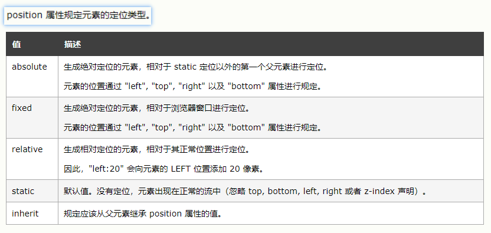

<<<<<<< HEAD
# flex 布局

- flex布局后，子元素的float，clear和vertical-align属性失效

## 容器上

### flex-direction 定主轴的方向（即项目的排列方向）。

- 决定主轴的方向（即项目的排列方向）。
    1. row（默认值）：主轴为水平方向，起点在左端。
    2. row-reverse：主轴为水平方向，起点在右端。
    3. column：主轴为垂直方向，起点在上沿。
    4. column-reverse：主轴为垂直方向，起点在下沿。

### flex-wrap 如果一条轴线排不下，换行。

- 如果一条轴线排不下，换行。
    1. nowrap（默认）：不换行。
    2. wrap：换行，第一行在上方。
    3. wrap-reverse：换行，第一行在下方。

### flex-flow 上面俩的简写

- flex-flow属性是flex-direction属性和flex-wrap属性的简写形式，默认值为row nowrap。

### justify-content 项目在主轴上的对齐方式。

- 项目在主轴上的对齐方式。
    1. flex-start（默认值）：左对齐
    2. flex-end：右对齐
    3. center： 居中
    4. space-between：两端对齐，项目之间的间隔都相等。
    5. space-around：每个项目两侧的间隔相等。所以，项目之间的间隔比项目与边框的间隔大一倍。

### align-items 项目在交叉轴上如何对齐。

- 项目在交叉轴上如何对齐。
    1. flex-start：交叉轴的起点对齐。
    2. flex-end：交叉轴的终点对齐。
    3. center：交叉轴的中点对齐。
    4. baseline: 项目的第一行文字的基线对齐。
    5. stretch（默认值）：如果项目未设置高度或设为auto，将占满整个容器的高度。

### align-content 多根轴线的对齐方式。
- 如果项目只有一根轴线，该属性不起作用。
    1. flex-start：与交叉轴的起点对齐。
    2. flex-end：与交叉轴的终点对齐。
    3. center：与交叉轴的中点对齐。
    4. space-between：与交叉轴两端对齐，轴线之间的间隔平均分布。
    5. space-around：每根轴线两侧的间隔都相等。所以，轴线之间的间隔比轴线与边框的间隔大一倍。
    6. stretch（默认值）：轴线占满整个交叉轴。

## 项目上

### order属性定义项目的排列顺序。
- 数值越小，排列越靠前，默认为0。

### flex-grow属性定义项目的放大比例
- 默认为0，即如果存在剩余空间，也不放大。

### flex-shrink属性定义了项目的缩小比例
- 默认为1，即如果空间不足，该项目将缩小。

### flex-basis属性定义了在分配多余空间之前，项目占据的主轴空间。浏览器根据这个属性，计算主轴是否有多余空间。
- 它的默认值为auto，即项目的本来大小。

### flex属性是上面三个的简写，默认值为0 1 auto。
- auto (1 1 auto) 和 none (0 0 auto)。建议优先使用这个属性，而不是单独写三个分离的属性，因为浏览器会推算相关值。

### align-self属性允许单个项目有与其他项目不一样的对齐方式，可覆盖align-items属性。
=======
# flex 布局

- flex布局后，子元素的float，clear和vertical-align属性失效

## 容器上

### flex-direction 定主轴的方向（即项目的排列方向）。

- 决定主轴的方向（即项目的排列方向）。
    1. row（默认值）：主轴为水平方向，起点在左端。
    2. row-reverse：主轴为水平方向，起点在右端。
    3. column：主轴为垂直方向，起点在上沿。
    4. column-reverse：主轴为垂直方向，起点在下沿。

### flex-wrap 如果一条轴线排不下，换行。

- 如果一条轴线排不下，换行。
    1. nowrap（默认）：不换行。
    2. wrap：换行，第一行在上方。
    3. wrap-reverse：换行，第一行在下方。

### flex-flow 上面俩的简写

- flex-flow属性是flex-direction属性和flex-wrap属性的简写形式，默认值为row nowrap。

### justify-content 项目在主轴上的对齐方式。

- 项目在主轴上的对齐方式。
    1. flex-start（默认值）：左对齐
    2. flex-end：右对齐
    3. center： 居中
    4. space-between：两端对齐，项目之间的间隔都相等。
    5. space-around：每个项目两侧的间隔相等。所以，项目之间的间隔比项目与边框的间隔大一倍。

### align-items 项目在交叉轴上如何对齐。

- 项目在交叉轴上如何对齐。
    1. flex-start：交叉轴的起点对齐。
    2. flex-end：交叉轴的终点对齐。
    3. center：交叉轴的中点对齐。
    4. baseline: 项目的第一行文字的基线对齐。
    5. stretch（默认值）：如果项目未设置高度或设为auto，将占满整个容器的高度。

### align-content 多根轴线的对齐方式。
- 如果项目只有一根轴线，该属性不起作用。
    1. flex-start：与交叉轴的起点对齐。
    2. flex-end：与交叉轴的终点对齐。
    3. center：与交叉轴的中点对齐。
    4. space-between：与交叉轴两端对齐，轴线之间的间隔平均分布。
    5. space-around：每根轴线两侧的间隔都相等。所以，轴线之间的间隔比轴线与边框的间隔大一倍。
    6. stretch（默认值）：轴线占满整个交叉轴。

## 项目上

### order属性定义项目的排列顺序。
- 数值越小，排列越靠前，默认为0。

### flex-grow属性定义项目的放大比例
- 默认为0，即如果存在剩余空间，也不放大。

### flex-shrink属性定义了项目的缩小比例
- 默认为1，即如果空间不足，该项目将缩小。

### flex-basis属性定义了在分配多余空间之前，项目占据的主轴空间。浏览器根据这个属性，计算主轴是否有多余空间。
- 它的默认值为auto，即项目的本来大小。

### flex属性是上面三个的简写，默认值为0 1 auto。
- auto (1 1 auto) 和 none (0 0 auto)。建议优先使用这个属性，而不是单独写三个分离的属性，因为浏览器会推算相关值。

### align-self属性允许单个项目有与其他项目不一样的对齐方式，可覆盖align-items属性。
>>>>>>> 3060b42 (第一次Git提交所有文件)
- 默认值为auto，表示继承父元素的align-items属性，如果没有父元素，则等同于stretch。