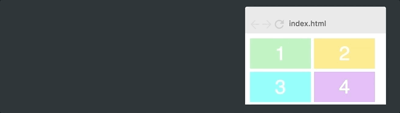
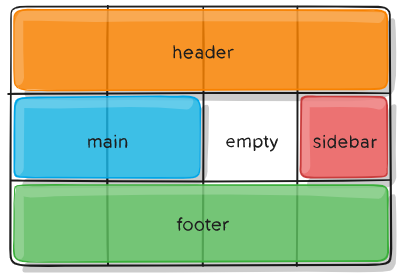

# CSS Grid布局

- CSS Grid 布局由两个核心组成部分是**网格容器**Grid Container和 **网格项**Grid Item（**子元素**）。items 是 grid(网格) 内的内容。

    - 布局
        1. `grid-template-row`：定义行
        2. `grid-template-column`：定义列

    - 定位和调整 items(子元素) 大小
        1. `grid-column`：定义网格元素**列**开始和结束的位置。
        2. `grid-row`：定义网格元素**行**开始和结束的位置。


- 等分单位，`fr`,允许将容器可用空间分成你想要的多个等分空间。

    ```css
    .container {
        display: grid;
        grid-template-columns: 1fr 1fr 1fr;
        grid-template-rows: 50px 50px;
    }
    ```
    

- `repeat()`指定列和行更nb的方法

    ```css
    .container {
        display: grid;
        grid-template-columns: repeat(3, 100px);
        grid-template-rows: repeat(2, 50px);
    }
    // repeat(3, 100px) <=> 100px 100px 100px
    ```

- `auto-fit`自适应

    ```css
    .container {
        display: grid;
        grid-gap: 5px;  /* 行与列的间隙50px */
        grid-template-columns: repeat(auto-fit, 100px);
        grid-template-rows: repeat(2, 100px);
    }
    ```
    


- `minmax()`解决自适应的缺点（宽度可能不够，会留下空白区域:arrow_up:）

    ```css
    .container {
        display: grid;
        grid-gap: 5px;
        grid-template-columns: repeat(auto-fit, minmax(100px, 1fr));
        grid-template-rows: repeat(2, 100px);
    }
    // minmax(100px, 1fr) 替换 100px
    ```
    

-  `object-fit:over`使图片覆盖整个容器，如果需要的话，浏览器会裁剪该图片。


## 父元素 网格容器(Grid Container) 属性

- `display: grid | inline-grid`：块级网格、内联网格

- `grid-auto-flow`：自动放置算法会自动放置这些网格项。

    1. `row`：依次填充每行，根据需要添加新行 （默认）
    2. `column`：依次填入每列，根据需要添加新列
    3. `dense`：在稍后出现较小的网格项时，尝试填充网格中较早的空缺
    4. `row dense | column dense`
        > dense 只会更改网格项的可视顺序,乱序。
    

- `grid-template-areas`：通过引用 `grid-area` 属性指定的 网格区域(Grid Area) 名称来定义网格模板。重复网格区域的名称导致内容跨越这些单元格

    1. `<grid-area-name>`：由网格项的 grid-area 指定的网格区域名称
    2. `.`（点号） ：代表一个空的网格单元
    3. `none`：不定义网格区域
        ```css
        .item-a {
            grid-area: header;
        }
        .item-b {
            grid-area: main;
        }
        .item-c {
            grid-area: sidebar;
        }
        .item-d {
            grid-area: footer;
        }
        .container {
        grid-template-columns: 50px 50px 50px 50px;
        grid-template-rows: auto;
        grid-template-areas: 
            "header header header header"
            "main main . sidebar"
            "footer footer footer footer";
        }
        // 整个顶行将由 header 区域组成。中间一排将由两个 main 区域，一个是空单元格，一个 sidebar 区域组成。最后一行全是 footer 区域组成。
        ```
        


- `justify-content`：沿着 inline（行）轴线对齐网格。`align-content`：沿着 block（列）轴线对齐网格。

    1. `start`：左侧对齐（顶部对齐）
    2. `end`：右侧对齐（底部对齐）
    3. `center`：水平居中对齐
    4. `stretch`：调整 网格项(grid items) 的宽度，**填充满**整个 网格容器 的宽度
    5. `space-around`：在每个网格项之间放置一个均匀的空间，左右（上下）两端放置一半的空间
    6. `space-between`：在每个网格项之间放置一个均匀的空间，左右（上下）两端没有空间
    7. `space-evenly`：在每个网格项目之间放置一个均匀的空间，左右（上下）两端放置一个均匀的空间


## 子元素 网格项(Grid Items) 属性

- `justify-self`：沿着 inline（行）轴线对齐网格项。`align-self`：沿着 block（列）轴线对齐网格项。`place-self`是以上的简写。

    1. `start`：左侧对齐（顶部对齐）
    2. `end`：右侧对齐（底部对齐）
    3. `center`：水平居中对齐
    4. `stretch`：填满单元格的宽度，默认值

- 