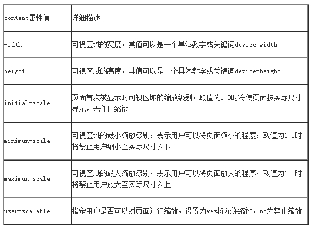

# Media Queries

- ***IE6-8浏览器不支持。Media Queries不要在不同的浏览器中添加前缀。***

- Media Queries并不能改变图片“src”的属性值

## 媒体类型

|值|设备类型|
|---|---|
|***All***|所有设备|
|Braille|盲人用点字法触觉回馈设备|
|Embossed|盲文打印机|
|Handheld|便携设备|
|***Print***|打印用纸或打印预览视图|
|Projection|各种投影设备|
|***Screen***|电脑显示器|
|Speech|语音或音频合成器|
|Tv|电视机类型设备|
|Tty|使用固定密度字母栅格的媒介，比如电传打字机和终端|  


> ***Screen、All和Print***为最常见的三种媒体类型。没有指明**默认为All**

- 媒体类型的引用方法也有多种，常见的有：***link标签、@import和CSS3新增的@media几种***
    1. link方法   
        * 通过link标签中的media属性来指定不同的媒体类型
            ```
            <link rel="stylesheet" type="text/css" href="style.css" media="screen" />
            ```
    2. @import方法  
        * 可以引用样式文件，也可以用来引用媒体类型
        ```
        /* 第一种 在样式中调用 */
        @importurl(reset.css) screen;   
        @importurl(print.css) print;

        /* 第二种  在<head>中的<style>标签中引入*/
        <head>
        <style type="text/css">
            @importurl(style.css) all;
        </style>
        </head>
        ```

    3. @media方法  
        ```
        /* 第一种 在样式中引用 */
        @media screen {
            选择器{/*你的样式代码写在这里…*/}
        }

        /* 第二种  在<head>中的<style>标签中引入*/
        <head>
        <style type="text/css">
            @media screen{
                选择器{/*你的样式代码写在这里…*/}
            }
        </style>
        </head>
        ```

## Media Queries使用方法

- @media 媒体类型and （媒体特性）{你的样式}
    - 媒体特性，一个部分指的是媒体特性，第二部分为媒体特性所指定的值，而且这两个部分之间使用冒号分隔。例如：(max-width: 480px)  
    > 媒体特性是通过**min/max**来表示**大于等于或小于**做为逻辑判断

1. 最大宽度max-width  
    媒体类型**小于或等于**指定的宽度时，样式生效。
    ```
    /* 当屏幕小于或等于480px时,页面中的广告区块（.ads）都将被隐藏。 */
    @media screen and (max-width:480px){
        .ads {  display:none;  }
    }
    ```


2. 最小宽度min-width  
    媒体类型**大于或等于**指定宽度时，样式生效。
    ```
    /* 当屏幕大于或等于900px时，容器“.wrapper”的宽度为980px。 */
    @media screen and (min-width:900px){
        .wrapper{ width: 980px; }
    }
    ```

3. 多个媒体特性使用  
    可以使用关键词"and"将多个媒体特性结合在一起。
    ```
    /* 当屏幕在600px~900px之间时，body的背景色渲染为“#f5f5f5” */
    @media screen and (min-width:600px) and (max-width:900px){
        body { background-color:#f5f5f5; }
    }
    ```

4. 设备屏幕的输出宽度Device Width
    在智能设备上，可以根据屏幕设备的尺寸来设置相应的样式（或者调用相应的样式文件）。
    ```
    /*  “iphone.css”样式适用于最大设备宽度为480px， */
    <link rel="stylesheet" media="screen and (max-device-width:480px)" href="iphone.css" />
    ```

5. not关键词   
    使用关键词“not”是用来排除某种制定的媒体类型，也就是用来排除符合表达式的设备。
     ```
    /* 样式代码将被使用在除打印设备和设备宽度小于1200px下所有设备中。  */
    @media not print and (max-width: 1200px){样式代码}
    ```


6. only关键词
    only用来指定某种特定的媒体类型，可以用来排除不支持媒体查询的浏览器。其实only很多时候是用来对那些不支持Media Query但却支持Media Type的设备隐藏样式表的。
    1. 支持媒体特性的设备，正常调用样式，此时就当only不存在；
    2. 表示不支持媒体特性但又支持媒体类型的设备，这样就会不读样式，因为其先会读取only而不是screen；
    3. 另外不支持Media Queries的浏览器，不论是否支持only，样式都不会被采用。


# Responsive设计


- “Responsive设计简单的称为RWD，是精心提供各种设备都能浏览网页的一种设计方法，RWD能让你的网页在不同的设备中展现不同的设计风格。”RWD不是流体布局，也不是网格布局，而是一种**独特的网页设计方法**。  


- 响应式设计要考虑元素布局的秩序，需要满足以下三个条件：
    1. 网站必须建立灵活的网格基础；
    2. 引用到网站的图片必须是可伸缩的；
    3. 不同的显示风格，需要在Media Queries上写不同的样式。


1. **流体网格**  
    流体网格是一个简单的网格系统，将每个网格格子使用百分比单位来控制网格大小。让你的网格大小随时根据屏幕尺寸大小做出相对应的***比例缩放***。

2. **弹性图片**  
    不给图片设置固定尺寸，而是根据流体网格进行缩放，用于适应各种网格的尺寸。
    
    
3. **媒体查询**   
    响应式设计中最为关键的。Responsive设计最关注的就是：根据用户的使用设备的当前宽度，你的Web页面将加载一个备用的样式，实现特定的页面风格。


4. **屏幕分辨率**  
    用户显示器的分辨率，Responsive设计利用Media Queries属性针对浏览器使用的分辨率来适配对应的CSS样式。因此屏幕分辨率在Responsive设计中是一个*很重要*的东西，因为只有知道Web页面要在哪种分辨率下显示何种效果，才能调用对应的样式。


5. **主要断点**  
    使用主要断点和次要断点，创建媒体查询的条件。而每个断点会对应调用一个样式文件（或者样式代码）。  
    或者在不同的断点加载不同的样式文件。
    1. 满足主要的断点；
    2. 有可能的话添加一些别的断点；
    3. 设置高于1024的桌面断点。


## Responsive布局技巧

- Responsive布局中，可以毫无保留的丢弃：

    第一， 尽量少用无关紧要的div；

    第二，不要使用内联元素（inline）；

    第三，尽量少用JS或flash；

    第四，丢弃没用的绝对定位和浮动样式；

    第五，摒弃任何冗余结构和不使用100%设置。

- 帮助Responsive确定更好的布局

    第一，使用HTML5 Doctype和相关指南；

    第二，重置好你的样式（reset.css）；

    第三，一个简单的有语义的核心布局；

    第四，给重要的网页元素使用简单的技巧，比如导航菜单之类元素。

无非是为了保持你的HTML简单干净，而且在你的页面布局中的关键部分（元素）不要过分的依赖现代技巧来实现，比如说CSS3特效或者JS脚本。


## Responsive设计——meta标签

- 没有这个meta标签，响应式设计就是**空谈**。  
    一个meta标签被称为可视区域meta标签
    ```
    <meta name=”viewport” content=”” />
    ```
      


    禁止其默认的自适应页面的效果:
    ```
    <meta name=”viewport” content=”width=device-width,initial-scale=1.0” />
    ```


## Responsive设计——不同设备的分辨率设置

1. 1024px显屏
    ```
    @media screen and (max-width : 1024px) {  /* 样式写在这里 */ } 
    ```

    
2. 800px显屏
    ...
3. 640px显屏
    ...
4. iPad横板显屏
    ```
    @media screen and (max-device-width: 1024px) and (orientation: landscape) {     /* 样式写在这 */   } 
    ```
    
5. iPad竖板显屏
    ```
    @media screen and (max-device-width: 768px) and (orientation: portrait) { /* 样式写在这 */   }   
    ```
  
6. iPhone 和 Smartphones
    ```
    @media screen and (min-device-width: 320px) and (min-device-width: 480px) { /* 样式写在这 */   }     
    ```
