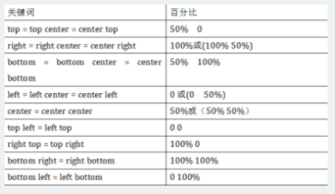
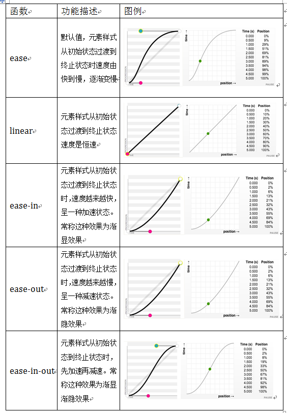

# 变形

- -webkit 是表示针对 safari 浏览器支持，-ms表示针对 IE 浏览器支持。-moz是表示对Firefox浏览器支持。

## 8.1 CSS3变形--旋转 rotate()

- 旋转rotate()函数通过指定的角度参数使元素相对原点进行旋转。它主要在二维空间内进行操作，设置一个角度值，用来指定旋转的幅度。  
    > 如果这个值为正值，元素相对原点中心顺时针旋转；如果这个值为负值，元素相对原点中心逆时针旋转。


## 8.2 CSS3中的变形--扭曲 skew()

- 扭曲skew()函数能够让元素倾斜显示。它可以将一个对象以其中心位置围绕着X轴和Y轴按照一定的角度倾斜。skew()函数不会旋转，而只会改变元素的形状。
    1. skew(x,y)使元素在水平和垂直方向同时扭曲
    2. skewX(x)仅使元素在水平方向扭曲变形（X轴扭曲变形）
    3. skewY(y)仅使元素在垂直方向扭曲变形（Y轴扭曲变形）


## 8.3 CSS3中的变形--缩放 scale()

- 缩放 scale()函数 让元素根据中心原点对对象进行缩放。
    1. scale(X,Y)使元素水平方向和垂直方向同时缩放
    2. scaleX(x)元素仅水平方向缩放（X轴缩放）
    3. scaleY(y)元素仅垂直方向缩放（Y轴缩放）
    >  scale()的取值默认的值为1，当值设置为0.01到0.99之间的任何值，作用使一个元素缩小；而任何大于或等于1.01的值，作用是让元素放大。


## 8.4 CSS3中的变形--位移 translate()

- translate()函数可以将元素向指定的方向移动，类似于position中的relative。或以简单的理解为，使用translate()函数，可以把元素从原来的位置移动，而不影响在X、Y轴上的任何Web组件。
    1. translate(x,y)水平方向和垂直方向同时移动
    2. translateX(x)仅水平方向移动（X轴移动）
    3. translateY(Y)仅垂直方向移动（Y轴移动）


## 8.5 CSS3中的变形--矩阵 matrix()

- matrix() 是一个含六个值的(a,b,c,d,e,f)变换矩阵，用来指定一个2D变换，相当于直接应用一个[a b c d e f]变换矩阵。就是基于水平方向（X轴）和垂直方向（Y轴）重新定位元素。


## 8.6 CSS3中的变形--原点 transform-origin

- 旋转、位移、缩放，扭曲等操作都是以元素自己中心位置进行变形。通过transform-origin来对元素进行***原点位置改变***，使元素原点不在元素的中心位置，以达到需要的原点位置。
    


## CSS3的过度transition属性是一个复合属性，主要包括以下几个子属性：

- transition可以把这些字属性串在一起,多个用","隔开
    > 但需要值得注意的一点：第一个时间的值为 transition-duration过渡时间，第二个为transition-delay延迟时间。如:transition:background 0.8s ease 0.3,color 0.6s ease-out 0.3;
    1. transition-property:指定过渡或动态模拟的CSS属性
    2. transition-duration:指定完成过渡所需的时间
    3. transition-timing-function:指定过渡函数
    4. transition-delay:指定开始出现的延迟时间


### 8.7 CSS3中的动画--过渡属性 transition-property

- 就是通过鼠标的单击、获得焦点，被点击或对元素任何改变中触发，并平滑地以动画效果改变CSS的属性值。
    ```
    div {
        width: 200px;
        height: 200px;
        background-color:red;
        margin: 20px auto;
        -webkit-transition: background-color .5s ease .1s;
        transition: background-color .5s ease .1s;
    }
    div:hover {
        background-color: orange;
    }
    ```
    > 设置了样式“width”,“height”,“background”,当你在终***始状态都改变了这三个属性，那么all代表的就是“width”、“height”和“background”***。如果你的终始状态只改变了“width”和“height”时，那么all代表的就是“width”和“height”。


### 8.8 CSS3中的动画--过渡所需时间 transition-duration

- 设置一个属性过渡到另一个属性所需的时间


### 8.9 CSS3中的动画--过渡函数 transition-timing-function

- 浏览器的过渡速度，以及过渡期间的操作进展情况
    参数:  
    


### 8.10 CSS3中的动画--过渡延迟时间 transition-delay

- 过渡延迟时间
