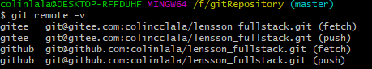

<<<<<<< HEAD
## 初始化本地库

- `git init`初始化本地库。

## 添加文件到Git仓库

1. 使用命令`git add <file>`，添加到暂存区

2. 使用命令`git commit -m "message"`完成，将暂存区的文件提交到本地库。

## 查看历史记录（提交日志）

- 使用`git log`命令查看版本详细信息，使用`git reflog`用查看版本信息。

- 如果嫌输出信息太多，看得眼花缭乱的，可以加上`git log --pretty=oneline`

- 用`git diff HEAD -- <file>`命令可以查看工作区和版本库里面最新版本的区别

## 回退上个版本

- 使用`git reset --hard HEAD^`命令

> 此时git log后查不到回退前的版本。**只要上面的命令行窗口还没有被关掉**，找到`commit id`(前6位即可),使用`git reset --hard <id>`。

## 把暂存区的修改回退到工作区

- 使用命令`git reset HEAD <file>`可以把暂存区的修改撤销掉（unstage），重新放回工作区。

## 查看内容

- `cat <file>`

## 修改

- `git checkout -- <file>`可以丢弃工作区的修改

    1. 一种是`<file>`自修改后还没有被放到暂存区，现在，撤销修改就回到和版本库一模一样的状态。
    2. 一种是`<file>`已经添加到暂存区后，又作了修改，现在，撤销修改就回到添加到暂存区后的状态。

- 如果改完文件后，已经`git add <file>`后，在`commit`之前，发现了这个问题。用`git status`查看一下，修改只是添加到了暂存区，还没有提交。
    **第一步**：使用命令`git reset HEAD <file>`可以把暂存区的修改撤销掉（unstage），重新放回工作区。
    **第二步**：使用命令`git checkout -- <file>`丢弃工作区的修改。

- `vim <文件名>`可修改文件，`i`进入编辑模式，`esc`进入命令模式。`:wq`保存修改并且退出vim，只想保存`:w`，退出`!q`。

## 删除

- 通常手动删除文件，或`rm <file>`删除文件，因此，工作区和版本库就不一致了。

    1. 从版本库中删除该文件，那就用命令`git rm`删掉，并且`git commit`。

        > 先手动删除文件，然后使用`git rm <file>`和`git add<file>`效果是一样的。

    2. 如果是删错了，因为版本库里还有呢，所以可以很轻松地把误删的文件恢复到最新版本，`git checkout`其实是用版本库里的版本替换工作区的版本，无论工作区是修改还是删除，都可以“一键还原”。

        > 从来没有被添加到版本库就被删除的文件，是无法恢复的！

## 分支

- 简单来说一个分支就是一个副本。

- `git branch 分支名`，**创建分支**。

- `git branch -v`，**查看分支**。

- `git checkout 分支名`，**切换分支**。

- `git merge 分支名`，**把指定的分支合并到当前分支上**。

## 团队协作

## 关联Gitee

- [获取SSH key](https://gitee.com/help/articles/4181#article-header0):

    
    1. 在终端`ssh-keygen -t ed25519 -C "xxxxx@xxxxx.com"`，后三次回车，查看磁c盘下用户的`./.ssh/id_ed25519.pub`文件，`id_ed25519.pub`是SSH公钥，`id_ed25519`是SSH私钥。

    2. 仓库添加ssh key后，终端 `ssh -T git@gitee.com`,并且首次使用需要确认并添加主机到本机SSH可信列表（yes）。即可。

- 关联gitee仓库

    - 本地库关联`<name>`的Gitee远程库`git remote add <name> git@gitee.com:xxxxxx/xxxxxx.git`。本地库关联`<name>`的GitHub远程库`git remote add <name> git@github.com:xxxxxx/xxxxxx.git`

    > `git remote -v`可以查看关联的远程库

    > `git remote rm <name>`可以删除已有的远程库

- 推送到GitHub：`git push github master`

- 推送到Gitee：`git push gitee master`

    

## 远程库操作

    https://gitee.com/colincclala/lesson_fullstack.git

- `git remote -v`，查看当前所有远程地址别名。

- `git remote add 别名 远程地址`，起别名。

- `git push 别名 分支`，推送本地分支上的内容到远程仓库。

- `git clone 远程地址`，将远程仓库的内容克隆到本地。

    1. 拉取代码
    2. 初始化本地仓库
    3. 创建别名

- `git pull 远程库地址别名 远程分支`，将远程仓库对于分支最新内容拉下来后与当前本地分支直接合并。
=======
## 初始化本地库

- `git init`初始化本地库。

## 添加文件到Git仓库

1. 使用命令`git add <file>`，添加到暂存区

2. 使用命令`git commit -m "message"`完成，将暂存区的文件提交到本地库。

## 查看历史记录（提交日志）

- 使用`git log`命令查看版本详细信息，使用`git reflog`用查看版本信息。

- 如果嫌输出信息太多，看得眼花缭乱的，可以加上`git log --pretty=oneline`

- 用`git diff HEAD -- <file>`命令可以查看工作区和版本库里面最新版本的区别

## 回退上个版本

- 使用`git reset --hard HEAD^`命令

> 此时git log后查不到回退前的版本。**只要上面的命令行窗口还没有被关掉**，找到`commit id`(前6位即可),使用`git reset --hard <id>`。

## 把暂存区的修改回退到工作区

- 使用命令`git reset HEAD <file>`可以把暂存区的修改撤销掉（unstage），重新放回工作区。

## 查看内容

- `cat <file>`

## 修改

- `git checkout -- <file>`可以丢弃工作区的修改

    1. 一种是`<file>`自修改后还没有被放到暂存区，现在，撤销修改就回到和版本库一模一样的状态。
    2. 一种是`<file>`已经添加到暂存区后，又作了修改，现在，撤销修改就回到添加到暂存区后的状态。

- 如果改完文件后，已经`git add <file>`后，在`commit`之前，发现了这个问题。用`git status`查看一下，修改只是添加到了暂存区，还没有提交。
    **第一步**：使用命令`git reset HEAD <file>`可以把暂存区的修改撤销掉（unstage），重新放回工作区。
    **第二步**：使用命令`git checkout -- <file>`丢弃工作区的修改。

- `vim <文件名>`可修改文件，`i`进入编辑模式，`esc`进入命令模式。`:wq`保存修改并且退出vim，只想保存`:w`，退出`!q`。

## 删除

- 通常手动删除文件，或`rm <file>`删除文件，因此，工作区和版本库就不一致了。

    1. 从版本库中删除该文件，那就用命令`git rm`删掉，并且`git commit`。

        > 先手动删除文件，然后使用`git rm <file>`和`git add<file>`效果是一样的。

    2. 如果是删错了，因为版本库里还有呢，所以可以很轻松地把误删的文件恢复到最新版本，`git checkout`其实是用版本库里的版本替换工作区的版本，无论工作区是修改还是删除，都可以“一键还原”。

        > 从来没有被添加到版本库就被删除的文件，是无法恢复的！

## 分支

- 简单来说一个分支就是一个副本。

- `git branch 分支名`，**创建分支**。

- `git branch -v`，**查看分支**。

- `git checkout 分支名`，**切换分支**。

- `git merge 分支名`，**把指定的分支合并到当前分支上**。

## 团队协作

## 关联Gitee

- [获取SSH key](https://gitee.com/help/articles/4181#article-header0):

    
    1. 在终端`ssh-keygen -t ed25519 -C "xxxxx@xxxxx.com"`，后三次回车，查看磁c盘下用户的`./.ssh/id_ed25519.pub`文件，`id_ed25519.pub`是SSH公钥，`id_ed25519`是SSH私钥。

    2. 仓库添加ssh key后，终端 `ssh -T git@gitee.com`,并且首次使用需要确认并添加主机到本机SSH可信列表（yes）。即可。

- 关联gitee仓库

    - 本地库关联`<name>`的Gitee远程库`git remote add <name> git@gitee.com:xxxxxx/xxxxxx.git`。本地库关联`<name>`的GitHub远程库`git remote add <name> git@github.com:xxxxxx/xxxxxx.git`

    > `git remote -v`可以查看关联的远程库

    > `git remote rm <name>`可以删除已有的远程库

- 推送到GitHub：`git push github master`

- 推送到Gitee：`git push gitee master`

    

## 远程库操作

    https://gitee.com/colincclala/lesson_fullstack.git

- `git remote -v`，查看当前所有远程地址别名。

- `git remote add 别名 远程地址`，起别名。

- `git push 别名 分支`，推送本地分支上的内容到远程仓库。

- `git clone 远程地址`，将远程仓库的内容克隆到本地。

    1. 拉取代码
    2. 初始化本地仓库
    3. 创建别名

- `git pull 远程库地址别名 远程分支`，将远程仓库对于分支最新内容拉下来后与当前本地分支直接合并。
>>>>>>> 3060b42 (第一次Git提交所有文件)
