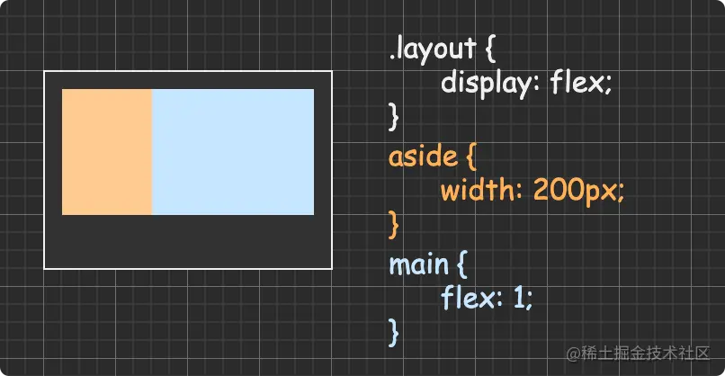

<!--
 * @Author: ZYH
 * @Email: 1522302196@qq.com
 * @GiteeId: colincclala
 * @Date: 2022-05-15 16:31:39
 * @LastEditTime: 2022-05-15 18:23:27
 * @Description: 
-->
## 1. 两列式布局：
- 
    1. 利用浮动实现的两列式布局
    2. 浮动元素会脱离文档流，兄弟元素会忽略掉main，从父容器的最左侧排列。导致两列式布局实现不了，浮动的部位在main的上面。
    3. 为了实现两列式布局，利用BFC的原理，把main兄弟元素添加overflow:hidden，即创建了一个新BFC。
    4. BFC区域不会和float盒子重叠。

- 
    1. aside，main使用了语义化标签
    2. 浮动元素会脱离文档流，main列把浮动元素占据的200px避让开，形成了两列式布局，main是一个块级元素，默认占满父元素宽度。

- 
    1. 使用弹性布局解决了两列式布局
    2. 弹性布局是一个父元素与子元素们新的BFC，独立的渲染区域，也叫FFC
    3. 只在main设置flex为1，成为主元素，aside占于剩下的位置，自适应。

