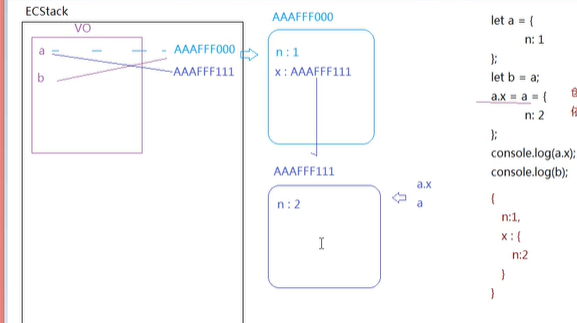

<<<<<<< HEAD
## 堆heap、栈stack

- 栈内存：提供代码运行的环境，存储***基本类型值***。
- 堆内存：提供***引用类型***存储的空间。

- 1
    ```
    // 1.创建变量 2. 创建值 3. 关联
    let a = 0;  // 在执行上下文栈（ECStack）(栈内存)的值存储区（变量对象VO）创建a变量，创建0.并且a指向0。
    let b = a; // 创建b变量，（b=a）b指向0值。
    b++;       // b=b+1 左边变量，右边值，所以b指向1。
    alert(a); // "0"

    let o = {};  // 在执行上下文栈的值存储区（变量对象VO）创建o变量，创建一个堆，地址（例如AAAFFF000），并且在ECStack中o指向地址的引用AAAFFF000。
    o.a = 0;    // o通过地址AAAFFF000找到堆，然后添加属性a，赋值0
    let b = o;  // 在执行上下文栈的值存储区（变量对象VO）创建b变量，b指向AAAFFF000。
    b.a = 10;   // b通过地址AAAFFF000找到堆，然后修改属性a，赋值10
    alert(o.a);  // "10"
    ```
- 2
    ```
    let a = {  // 在执行上下文栈的值存储区（变量对象VO）创建a变量，创建一个堆，地址（例如AAAFFF000），并且在ECStack中o指向地址的引用AAAFFF000。
        n:1; // a通过地址AAAFFF000找到堆，然后添加属性n，存值1
    };
    let b = a;  //在执行上下文栈的值存储区（变量对象VO）创建b变量，b指向AAAFFF000。
    a.x = a = { // =左边都存在，创建一个新的堆，地址(AAAFFF111)
        n:2;   // 添加属性n，存值2
    }; // (a.x={...}) a指向的堆(AAAFFF000)中添加属性x，存值AAAFFF111,(a={...})a指向新堆的引用AAAFFF111。
    console.log(a.x);   // undefined
    console.log(b);     //...
    ```
=======
## 堆heap、栈stack

- 栈内存：提供代码运行的环境，存储***基本类型值***。
- 堆内存：提供***引用类型***存储的空间。

- 1
    ```
    // 1.创建变量 2. 创建值 3. 关联
    let a = 0;  // 在执行上下文栈（ECStack）(栈内存)的值存储区（变量对象VO）创建a变量，创建0.并且a指向0。
    let b = a; // 创建b变量，（b=a）b指向0值。
    b++;       // b=b+1 左边变量，右边值，所以b指向1。
    alert(a); // "0"

    let o = {};  // 在执行上下文栈的值存储区（变量对象VO）创建o变量，创建一个堆，地址（例如AAAFFF000），并且在ECStack中o指向地址的引用AAAFFF000。
    o.a = 0;    // o通过地址AAAFFF000找到堆，然后添加属性a，赋值0
    let b = o;  // 在执行上下文栈的值存储区（变量对象VO）创建b变量，b指向AAAFFF000。
    b.a = 10;   // b通过地址AAAFFF000找到堆，然后修改属性a，赋值10
    alert(o.a);  // "10"
    ```
- 2
    ```
    let a = {  // 在执行上下文栈的值存储区（变量对象VO）创建a变量，创建一个堆，地址（例如AAAFFF000），并且在ECStack中o指向地址的引用AAAFFF000。
        n:1; // a通过地址AAAFFF000找到堆，然后添加属性n，存值1
    };
    let b = a;  //在执行上下文栈的值存储区（变量对象VO）创建b变量，b指向AAAFFF000。
    a.x = a = { // =左边都存在，创建一个新的堆，地址(AAAFFF111)
        n:2;   // 添加属性n，存值2
    }; // (a.x={...}) a指向的堆(AAAFFF000)中添加属性x，存值AAAFFF111,(a={...})a指向新堆的引用AAAFFF111。
    console.log(a.x);   // undefined
    console.log(b);     //...
    ```
>>>>>>> 3060b42 (第一次Git提交所有文件)
    