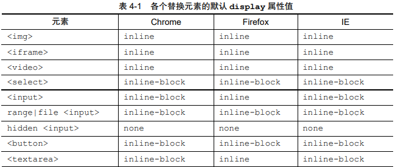

# 盒尺寸四大家族

## content

1. content 与替换元素

    - 通过修改某个属性值呈现的内容就可以被替换的元素就称为“替换元素”。
        1. 内容的外观不受页面上的 CSS 的影响。
        2. 有自己的尺寸。不包括边框默认尺寸：300x150
        3. 在很多 CSS 属性上有自己的一套表现规则。

    -  替换元素的默认 display 值，**所有的替换元素都是内联水平元素**。
        

        - `<input>`和`<button>`按钮的区别（Firefox下）：
            1. `<input>`的`white-space`是pre，按钮文字多**不会自动换行**。
            2. `<button>`的`white-space`是normal，按钮文字多**会自动换行**。

    
    - 替换元素的尺寸计算规则

        1. 固有尺寸，不受外界CSS影响
        2. HTML 尺寸，“HTML 尺寸”只能通过HTML 原生属性改变，``的 width 和 height 属性、`<input>`的 size 属性、`<textarea>`的 cols 和 rows 属性等
        3. CSS 尺寸。

            - 如果没有 CSS 尺寸和 HTML 尺寸，则使用固有尺寸作为最终的宽高。

            - 如果没有 CSS 尺寸，则使用 HTML尺寸。

            - 如果有 CSS 尺寸，则最终尺寸由 CSS 属性决定。

            - 如果“固有尺寸”含有固有的宽高比例，同时仅设置了宽度或仅设置了高度，则元素**依然按照固有的宽高比例显示**。

            - 默认300宽，150高

            - 内联替换元素和块级替换元素和上面一样

    - 替换元素和非替换元素的距离

        - ``没有src属性变成了和``一样的非替换元素，在Firefox下设置宽高没有作用。Chrome需要`alt`不为空就行。

        - `content`属性决定了是替换元素还是非替换元素。

    - content 与替换元素关系剖析

        - content 属性生成的内容都是替换元素!
            1. 使用 content 生成的文本是无法选中、无法复制的，content 属性只能用来生成一些无关紧要的内容。
            2. 不能左右:empty 伪类。
            3. content 动态生成值无法获取。

2. content 内容生成技术

    - content 辅助元素生成