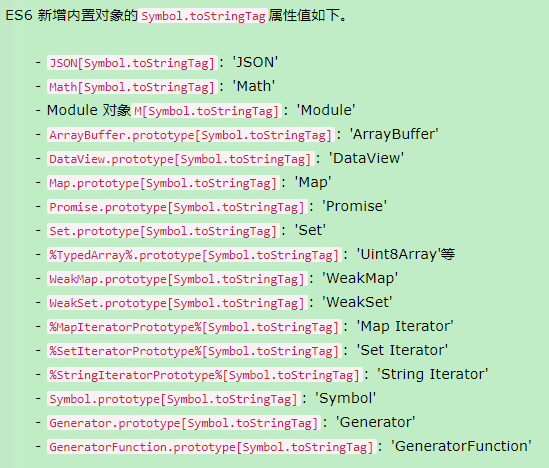

<!--
 * @Author: ZYH
 * @Email: 1522302196@qq.com
 * @GiteeId: colincclala
 * @Date: 2022-05-02 19:53:51
 * @LastEditTime: 2022-05-02 23:49:57
 * @Description: Symbol
 * 
-->
# Symbol

## 一、概述

- 保证每个属性的名字都是独一无二。

- Symbol 值通过Symbol()函数生成。对象的属性名现在可以有*两种类型*，一种是原来就有的字符串，另一种就是新增的 Symbol 类型。**凡是属性名属于 Symbol 类型，就都是独一无二的，可以保证不会与其他属性名产生冲突**。
    
    ```js
    let s = Symbol();
    typeof s
    // "symbol"
    ```

- Symbol函数前**不能使用new命令**，否则会报错。这是因为生成的 Symbol 是一个原始类型的值，不是对象。不能添加属性，是一种类似于字符串的数据类型。

- Symbol函数可以接受一个**字符串作为参数**，表示对 Symbol 实例的描述。

    ```js
    let s1 = Symbol('foo');
    let s2 = Symbol('bar');
    s1 // Symbol(foo)
    s2 // Symbol(bar)
    s1.toString() // "Symbol(foo)"
    s2.toString() // "Symbol(bar)"
    ```

- 如果 Symbol 的参数是一个**对象**，就会调用该对象的toString方法，将其转为字符串，然后才生成一个 Symbol 值。

    ```js
    const obj = {
        toString() {
            return 'abc';
    }
    };
    const sym = Symbol(obj);
    sym // Symbol(abc)
    ```

> Symbol函数的参数只是表示对当前 Symbol 值的描述，因此相同参数的Symbol函数的返回值是不相等的。

    ```js
    // 没有参数的情况
    let s1 = Symbol();
    let s2 = Symbol();
    s1 === s2 // false

    // 有参数的情况
    let s1 = Symbol('foo');
    let s2 = Symbol('foo');
    s1 === s2 // false

    //s1和s2都是Symbol函数的返回值，而且参数相同，但是它们是不相等的。
    ```

- Symbol 值不能与其他类型的值进行运算，会报错。

- Symbol 值可以显式转为字符串，也可以转为布尔值，但是不能转为数值。
    
    ```js
    let sym = Symbol();
    Boolean(sym) // true
    !sym  // false
    ```


## 二、Symbol.prototype.description

- 实例属性description，直接返回 Symbol 的描述。

    ```js
    const sym = Symbol('foo');
    sym.description // "foo"
    ```


## 三、作为属性名的Symbol

```js
let mySymbol = Symbol();

// 第一种写法
let a = {};
a[mySymbol] = 'Hello!';

// 第二种写法
let a = {
  [mySymbol]: 'Hello!'
};

// 第三种写法
let a = {};
Object.defineProperty(a, mySymbol, { value: 'Hello!' });

// 以上写法都得到同样结果
a[mySymbol] // "Hello!"
```

- Symbol 值作为对象属性名时，不能用点运算符。

    ```js
    const mySymbol = Symbol();
    const a = {};

    a.mySymbol = 'Hello!';
    a[mySymbol] // undefined
    a['mySymbol'] // "Hello!"
    ```


- 在**对象的内部**，使用 Symbol 值定义属性时，Symbol 值必须放在**方括号之中**。

    ```js
    let s = Symbol();
    let obj = {
        [s](arg) { ... }
    };
    obj[s](123);
    ```


## 四、实例：消除魔术字符串

- 魔术字符串，在代码之中多次出现、与代码形成强耦合的某一个具体的字符串或者数值。

- 只要确保不会跟其他shapeType属性的值冲突即可。因此，这里就很适合改用 Symbol 值。
    ```js
    const shapeType = {
        triangle: Symbol()
    };
    ```


## 五、属性名的遍历

- Symbol 作为属性名，遍历对象的时候，该属性不会出现在`for...in`、`for...of`循环中，也不会被`Object.keys()`、`Object.getOwnPropertyNames()`、`JSON.stringify()`返回。

- `Object.getOwnPropertySymbols()`方法，可以获取指定对象的所有 Symbol 属性名。该方法返回一个数组，成员是当前对象的所有用作属性名的 Symbol 值。

    ```js
    const obj = {};
    let a = Symbol('a');
    let b = Symbol('b');
    obj[a] = 'Hello';
    obj[b] = 'World';

    const objectSymbols = Object.getOwnPropertySymbols(obj);
    objectSymbols
    // [Symbol(a), Symbol(b)]
    ```

- `Reflect.ownKeys()`方法可以返回所有类型的**键名**，包括常规键名和 Symbol 键名。

    ```js
    let obj = {
        [Symbol('my_key')]: 1,
        enum: 2,
        nonEnum: 3
    };

    Reflect.ownKeys(obj)
    //  ["enum", "nonEnum", Symbol(my_key)]
    ```

> 由于以 Symbol 值作为键名，**不会被常规方法遍历得到**。我们可以利用这个特性，为对象定义一些非私有的、但又希望只用于内部的方法。

## 六、Symbol.for()、Symbol.keyFor()

1. `Symbol.for()`接受一个字符串作为参数，然后搜索有没有以该参数作为名称的 Symbol 值。有就返回这个 Symbol 值，没有就新建一个以该字符串为名称的 Symbol 值，并将其注册到全局。

    - 与`Symbol()`，都会生成新的 Symbol。**但`Symbol()`每次调用就返回一个新的 Symbol 类型的值**，**`Symbol.for()`会先检查给定的key是否已经存在，如果不存在才会新建一个值**。    
        - 例如：如果调用`Symbol.for("cat")`30 次，每次都会返回同一个 Symbol 值，但是调用`Symbol("cat")`30 次，会返回 30 个不同的 Symbol 值。

    
    - `Symbol.for()`为 Symbol 值**登记**的名字，是**全局环境**的，不管有没有在全局环境运行。


2. `Symbol.keyFor()`方法返回一个已登记的 Symbol 类型值的key。

    ```js
    let s1 = Symbol.for("foo");
    Symbol.keyFor(s1) // "foo"

    let s2 = Symbol("foo");
    Symbol.keyFor(s2) // undefined
    // 变量s2属于未登记的 Symbol 值，所以返回undefined。
    ```
    > 由于Symbol()写法**没有登记机制**，所以每次调用都会返回一个不同的值。


## 七、实例：模块Singleton模式

- Singleton 模式指的是调用一个类，任何时候返回的都是同一个实例。

    ```js
    // 加载 mod.js
    const a = require('./mod.js');  
    ```

## 八、内置的Symbol值

1. Symbol.hasInstance

    - 对象的`Symbol.hasInstance`属性，指向一个内部方法。(当使用`instanceof`运算符，会调用这个方法。比如，`foo instanceof Foo`在语言内部，实际调用的是`Foo[Symbol.hasInstance](foo)`。)

2. Symbol.isConcatSpreadable

    - 对象的`Symbol.isConcatSpreadable`属性等于一个布尔值，表示该对象用于`Array.prototype.concat()`时，是否可以展开。

        ```js
        let arr1 = ['c', 'd'];
        ['a', 'b'].concat(arr1, 'e') // ['a', 'b', 'c', 'd', 'e']
        arr1[Symbol.isConcatSpreadable] // undefined

        let arr2 = ['c', 'd'];
        arr2[Symbol.isConcatSpreadable] = false;
        ['a', 'b'].concat(arr2, 'e') // ['a', 'b', ['c','d'], 'e']

        // 数组的默认行为是可以展开，Symbol.isConcatSpreadable默认等于undefined。该属性等于true时，也有展开的效果。

        let obj = {length: 2, 0: 'c', 1: 'd'};
        ['a', 'b'].concat(obj, 'e') // ['a', 'b', obj, 'e']

        obj[Symbol.isConcatSpreadable] = true;
        ['a', 'b'].concat(obj, 'e') // ['a', 'b', 'c', 'd', 'e']
        ```

3. Symbol.species?????????????????????????????????????
    
    - 对象的`Symbol.species`属性，指向一个构造函数。创建衍生对象时，会使用该属性。
    
    - `Symbol.species`的作用在于，实例对象在运行过程中，需要再次调用自身的构造函数时，会调用该属性指定的构造函数。它主要的用途是，有些类库是在基类的基础上修改的，那么子类使用继承的方法时，作者可能希望返回基类的实例，而不是子类的实例。


4. Symbol.match??????????????????????????????????????

    - 对象的`Symbol.match`属性，指向一个函数。当执行`str.match(myObject)`时，如果该属性存在，会调用它，返回该方法的返回值。


5. Symbol.replace

    - 对象的`Symbol.replace`属性，指向一个方法，当该对象被`String.prototype.replace`方法调用时，会返回该方法的返回值。

        ```js
        String.prototype.replace(searchValue, replaceValue)
        // 等同于
        searchValue[Symbol.replace](this, replaceValue)
        ````

6. Symbol.search????????????????????????????????????????

    - 对象的`Symbol.search`属性，指向一个方法，当该对象被`String.prototype.search`方法调用时，会返回该方法的返回值。


7. Symbol.split

    - 对象的`Symbol.split`属性，指向一个方法，当该对象被`String.prototype.split`方法调用时，会返回该方法的返回值。

        ```js
        String.prototype.split(separator, limit)
        // 等同于
        separator[Symbol.split](this, limit)
        ```

8. Symbol.iterator

    - 对象的`Symbol.iterator`属性，指向该对象的默认遍历器方法。

        ```js
        const myIterable = {};
        myIterable[Symbol.iterator] = function* () {
            yield 1;
            yield 2;
            yield 3;
        };

        [...myIterable] // [1, 2, 3]
        ```

9. Symbol.toPrimitive

    - 对象的`Symbol.toPrimitive`属性，指向一个方法。该对象被转为原始类型的值时，会调用这个方法，返回该对象对应的原始类型值。
    
        1. Number：该场合需要转成数值
        2. String：该场合需要转成字符串
        3. Default：该场合可以转成数值，也可以转成字符串

            ```js
            let obj = {
                [Symbol.toPrimitive](hint) {
                    switch (hint) {
                    case 'number':
                        return 123;
                    case 'string':
                        return 'str';
                    case 'default':
                        return 'default';
                    default:
                        throw new Error();
                    }
                }
            };

            2 * obj // 246
            3 + obj // '3default'
            obj == 'default' // true
            String(obj) // 'str'
            ```


10. Symbol.toStringTag

    - 对象的`Symbol.toStringTag`属性，指向一个方法。在该对象上面调用`Object.prototype.toString`方法时，如果这个属性存在，它的返回值会出现在`toString`方法返回的字符串之中，表示对象的类型。这个属性可以用来定制`[object Object]`或`[object Array]`中`object`后面的那个字符串。

        ```js
        // 例一
        ({[Symbol.toStringTag]: 'Foo'}.toString())
        // "[object Foo]"

        // 例二
        class Collection {
        get [Symbol.toStringTag]() {
            return 'xxx';
        }
        }
        let x = new Collection();
        Object.prototype.toString.call(x) // "[object xxx]"
        ```
        


11. Symbol.unscopables

    - 对象的`Symbol.unscopables`属性，指向一个对象。该对象指定了使用`with`关键字时，哪些属性会被`with`环境排除。