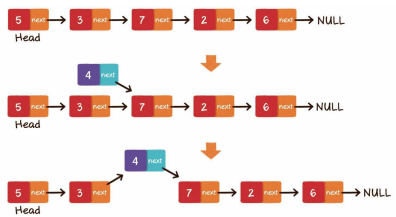
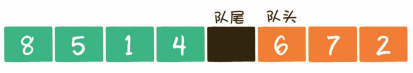
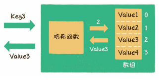
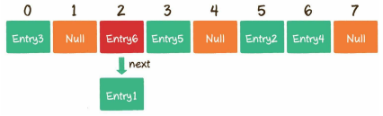
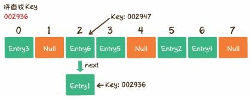
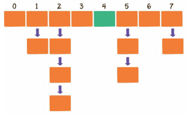
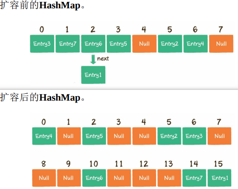

## 链表

1. 插入节点
    - 尾部插入
        把最后一个节点的next指针指向新插入的节点。
    - 头部插入
        1. 把新节点的next指针指向原先的头节点。
        2. 把新节点变为链表的头节点。
    - 中间插入
        1. 新节点的next指针，指向插入位置的节点。
        2. 插入位置前置节点的next指针，指向新节点。
            

2. 删除元素
    - 尾部删除
        把倒数第2个节点的next指针指向空。
    - 头部删除
        把链表的头节点设为原先头节点的next指针。
    - 中间删除
        把要删除节点的前置节点的next指针，指向要删除元素的下一个节点即可。


## 栈

- stack ，先入后出  FILO  ,栈底bottom，栈顶top。


## 队列

- queue，先入先出  FIFO，队头front，队尾rear。

1. 入队
    - enqueue，是把新元素放入队列中，只允许在队尾的位置放入元素，新元素的下一个位置将会成为新的队尾。
2. 出队
    - dequeue，就是把元素移出队列，只允许在队头一侧移出元素，出队元素的后一个元素将会成为新的队头。

- 数组不做扩容的前提下，容量会满。用*数组*实现的队列可以采用*循环队列*的方式来维持队列容量的恒定。

    - （队尾下标+1）%数组长度 = 队头下标，代表此队列真的已经满了。
        > 需要注意的是，队尾指针指向的位置永远空出1位，所以队列最大容量比数组长度小1。
            


## 栈和队列应用

1. 栈的应用
    - 栈通常用于对“历史”的回溯。
    - 一个著名的应用场景是**面包屑导航**，使用户在浏览页面时可以轻松地回溯到上一级或更上一级页面。

2. 队列的应用
    - 队列通常用于对“历史”的回放，也就是按照“历史”顺序，把“历史”重演一遍。
    - *多线程中*，按照访问顺序决定线程在队列中的次序
    - *网络爬虫实现网站抓取*，也是把待抓取的网站URL存入队列中，再按照存入队列的顺序来依次抓取和解析的。

3. 双端队列
    - 把栈和队列的特点结合起来（既可以先入先出，也可以先入后出）。

4. 优先队列（非线性，基于二叉堆）
    - 遵循谁的优先级高，谁先出队。


## 散队列（哈希表）

- 提供键（key），值（value），映射关系，(基于数组实现)。O(1)。

> 散列表的key是以字符串类型为主，***哈希函数***可以把key和数组下标转换。
    
    在Java及大多数面向对象的语言中，每一个对象都有属于自己的hashcode，这个hashcode是区分不同对象的重要标识。无论对象自身的类型是什么，它们的hashcode都是一个整型变量。
- 按照数组长度进行取模运算(位运算)。
    ```
    index = HashCode (Key) % Array.length

    // 可以把字符串或其他类型的Key，转化成数组的下标index。
    
    //给出一个长度为8的数组，则当key=001121时，
    index = HashCode ("001121") % Array.length =1420036703 % 8 = 7

    //而当key=this时，
    index = HashCode ("this") % Array.length = 3559070 % 8= 6
    ```

### 散列表的读写操作

1. 写操作（put）
    - 例如调用hashMap.put("002931", "王五")，意思是插入一组Key为002931、Value为王五的键值对。
        1. 通过哈希函数，把Key转化成数组下标5。
        2. 如果数组下标5对应的位置没有元素，就把这个Entry填充到数组下标5的位置。
            - 数组长度有限，获得的下标可能相同，*哈希冲突*。
                > 解决办法：
                > > 1. 开放寻址法，当一个Key通过哈希函数获得对应的数组下标已被占用时，寻找下一个空档位置。
                > > 2. 链表法（应用在了Java的集合类HashMap当中），HashMap数组的每一个元素不仅是一个Entry对象，还是一个链表的头节点。每一个Entry对象通过next指针指向它的下一个Entry节点。当新来的Entry映射到与之冲突的数组位置时，只需要插入到对应的链表中即可。
                    

2. 读操作（get）
    - 例如调用 hashMap.get("002936")，意思是查找Key为002936的Entry在散列表中所对应的值。
        1. 通过哈希函数，把Key转化成数组下标2。
        2. 找到数组下标2所对应的元素，如果这个元素的Key是002936，那么就找到了；如果这个Key不是002936，由于数组的每个元素都与一个链表对应，我们可以顺着链表慢慢往下找，看看能否找到与Key相匹配的节点。
            

3. 扩容（resize）
    
    这种情况，散列表就需要扩展它的长度，也就是进行扩容。
    对于JDK中的散列表实现类HashMap来说，影响其扩容的因素有两个。
    - Capacity，即HashMap的当前长度
    - LoadFactor，即HashMap的负载因子，默认值为0.75f
        ```
        // 衡量HashMap需要进行扩容的条件
        HashMap.Size >= Capacity×LoadFactor
        ```
        1. 扩容，创建一个新的Entry空数组，长度是原数组的2倍。
        2. 重新Hash，遍历原Entry数组，把所有的Entry重新Hash到新数组中。
            > 重新Hash，是因为长度扩大以后，Hash的规则也随之改变。经过扩容，原本拥挤的散列表重新变得稀疏，原有的Entry也重新得到了尽可能均匀的分配。
                


    > 关于HashMap的实现，JDK 8和以前的版本有着很大的不同。当多个Entry被Hash到同一个数组下标位置时，***为了提升插入和查找的效率，HashMap会把Entry的链表转化为红黑树这种数据结构***。