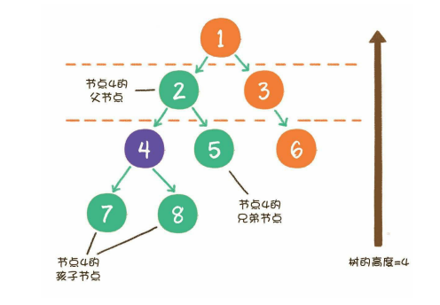
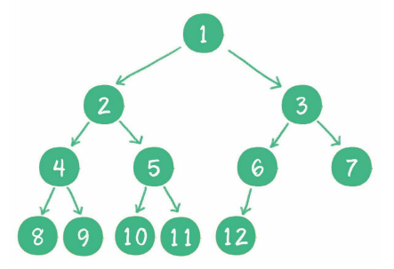
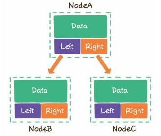
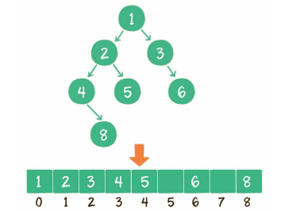

<<<<<<< HEAD
## 树和二叉树

1. 树
    树（tree）是n（n≥0）个节点的**有限集**。当n=0时，称为空树。在任意一个非空树中，有如下特点。
    - 有且仅有一个特定的称为根的节点。
    - 当n>1时，其余节点可分为m（m>0）个*互不相交*的有限集，每一个集合本身又是一个树，并称为根的*子树*。
        
            节点1是**根节点（root）**，节点5、6、7、8是树的末端，没有“孩子”，被称为**叶子节点（leaf）**。节点4的上一级节点，是节点4的**父节点（parent）**；从节点4衍生出来的节点，是节点4的**孩子节点（child）**；和节点4同级，由同一个父节点衍生出来的节点，是节点4的**兄弟节点（sibling）**。

2. 二叉树
    二叉树（binary tree）是树的一种特殊形式。这种树的每个节点**最多有2个孩子节点**。
    - 二叉树节点的两个孩子节点，一个被称为**左孩子（left child）**，一个被称为**右孩子（right child）**。
        1. 满二叉树
            **所有非叶子节点都存在左右孩子，并且所有叶子节点都在同一层级上，那么这个树就是满二叉树。**
        2. 完全二叉树
            **对一个有n个节点的二叉树，按层级顺序编号，则所有节点的编号为从1到n。如果这个树所有节点和同样深度的满二叉树的编号为从1到n的节点位置相同，则这个二叉树为完全二叉树。**
                
                    二叉树编号从1到12的12个节点，和前面满二叉树编号从1到12的节点位置完全对应。完全二叉树只需保证最后一个节点之前的节点都齐全即可。

    - 二叉树用**链式存储结构**存储
        

    - 二叉树用**数组**存储
        
        按照层级顺序把二叉树的节点放到数组中对应的位置上。如果某一个节点的左孩子或右孩子空缺，则数组的相应位置也空出来。
        - 假设一个父节点的下标是parent，那么它的左孩子节点下标就是2×parent + 1；右孩子节点下标就是2×parent + 2。
        - 反过来，假设一个左孩子节点的下标是leftChild，那么它的父节点下标就是（leftChild-1）/ 2。
            
    - 于一个稀疏的二叉树来说，用数组表示法是非常浪费空间的。

- 二叉树包含许多特殊的形式，每一种形式都有自己的作用，但是其最主要的应用还在于进行**查找操作和维持相对顺序**这两个方面。
    1. 查找
        二叉查找树（binary search tree）。  
        - 如果左子树不为空，则左子树上所有节点的值均小于根节点的值
        - 如果右子树不为空，则右子树上所有节点的值均大于根节点的值
        - 左、右子树也都是二叉查找树

        对于一个节点分布相对均衡的二叉查找树来说，如果节点总数是n，那么搜索节点的时间复杂度就是O(logn)，和树的深度是一样的。

    2. 维持相对顺序
        二叉排序树（binary sort tree）。

## 二叉树的遍历

1. **深度优先遍历（前序遍历、中序遍历、后序遍历）**
    1. 前序遍历
        根节点、左子树、右子树。

    2. 中序遍历
        左子树、根节点、右子树。

    3. 后序遍历
        左子树、右子树、根节点。

    

2. **广度优先遍历（层序遍历）**

- 就是二叉树按照从*根节点到叶子节点*的层次关系，一层一层横向遍历各个节点。（借助*队列*来辅助工作）

## 二叉堆

- 二叉堆本质上是一种**完全二叉树**，它分为两个类型。    
    1. 最大堆
        最大堆的任何一个父节点的值，都*大于或等于*它左、右孩子节点的值。

    2. 最小堆
        最小堆的任何一个父节点的值，都*小于或等于*它左、右孩子节点的值。

    二叉堆的根节点叫作*堆顶*。

- 二叉堆的自我调整（就是把一个不符合堆性质的完全二叉树，调整成一个堆。）
    1. 插入节点，O(logn)。
        简单来说，插入位置的父节点小于插入的，就交换，直到合适位置。
    2. 删除节点，O(logn)。
        简单来说，删除的节点用最后一个节点补，然后与左、右孩子小的交换，直到合适为止。
    3. 构建二叉堆，O(n)。
        构建二叉堆，也就是把一个无序的完全二叉树调整为二叉堆，本质就是让所有**非叶子节点依次“下沉”。**

- 二叉堆虽然是一个完全二叉树，但它的存储方式并不是链式存储，而是**顺序存储**（二叉堆的所有节点都存储在*数组*中）。
    假设父节点的下标是*parent*，那么它的左孩子下标就是*2×parent+1*；右孩子下标就是*2×parent+2*。

- 二叉堆是实现*堆排序*及*优先队列*的基础。

## 优先队列

- 优先队列不再遵循先入先出的原则，而是分为两种情况。

    - *最大优先队列，无论入队顺序如何，都是当前最大的元素优先出队*
    - *最小优先队列，无论入队顺序如何，都是当前最小的元素优先出队*

- 入队操作 == 堆的插入操作，出队操作 == 删除堆顶节点，O(logn)。

=======
## 树和二叉树

1. 树
    树（tree）是n（n≥0）个节点的**有限集**。当n=0时，称为空树。在任意一个非空树中，有如下特点。
    - 有且仅有一个特定的称为根的节点。
    - 当n>1时，其余节点可分为m（m>0）个*互不相交*的有限集，每一个集合本身又是一个树，并称为根的*子树*。
        
            节点1是**根节点（root）**，节点5、6、7、8是树的末端，没有“孩子”，被称为**叶子节点（leaf）**。节点4的上一级节点，是节点4的**父节点（parent）**；从节点4衍生出来的节点，是节点4的**孩子节点（child）**；和节点4同级，由同一个父节点衍生出来的节点，是节点4的**兄弟节点（sibling）**。

2. 二叉树
    二叉树（binary tree）是树的一种特殊形式。这种树的每个节点**最多有2个孩子节点**。
    - 二叉树节点的两个孩子节点，一个被称为**左孩子（left child）**，一个被称为**右孩子（right child）**。
        1. 满二叉树
            **所有非叶子节点都存在左右孩子，并且所有叶子节点都在同一层级上，那么这个树就是满二叉树。**
        2. 完全二叉树
            **对一个有n个节点的二叉树，按层级顺序编号，则所有节点的编号为从1到n。如果这个树所有节点和同样深度的满二叉树的编号为从1到n的节点位置相同，则这个二叉树为完全二叉树。**
                
                    二叉树编号从1到12的12个节点，和前面满二叉树编号从1到12的节点位置完全对应。完全二叉树只需保证最后一个节点之前的节点都齐全即可。

    - 二叉树用**链式存储结构**存储
        

    - 二叉树用**数组**存储
        
        按照层级顺序把二叉树的节点放到数组中对应的位置上。如果某一个节点的左孩子或右孩子空缺，则数组的相应位置也空出来。
        - 假设一个父节点的下标是parent，那么它的左孩子节点下标就是2×parent + 1；右孩子节点下标就是2×parent + 2。
        - 反过来，假设一个左孩子节点的下标是leftChild，那么它的父节点下标就是（leftChild-1）/ 2。
            
    - 于一个稀疏的二叉树来说，用数组表示法是非常浪费空间的。

- 二叉树包含许多特殊的形式，每一种形式都有自己的作用，但是其最主要的应用还在于进行**查找操作和维持相对顺序**这两个方面。
    1. 查找
        二叉查找树（binary search tree）。  
        - 如果左子树不为空，则左子树上所有节点的值均小于根节点的值
        - 如果右子树不为空，则右子树上所有节点的值均大于根节点的值
        - 左、右子树也都是二叉查找树

        对于一个节点分布相对均衡的二叉查找树来说，如果节点总数是n，那么搜索节点的时间复杂度就是O(logn)，和树的深度是一样的。

    2. 维持相对顺序
        二叉排序树（binary sort tree）。

## 二叉树的遍历

1. **深度优先遍历（前序遍历、中序遍历、后序遍历）**
    1. 前序遍历
        根节点、左子树、右子树。

    2. 中序遍历
        左子树、根节点、右子树。

    3. 后序遍历
        左子树、右子树、根节点。

    

2. **广度优先遍历（层序遍历）**

- 就是二叉树按照从*根节点到叶子节点*的层次关系，一层一层横向遍历各个节点。（借助*队列*来辅助工作）

## 二叉堆

- 二叉堆本质上是一种**完全二叉树**，它分为两个类型。    
    1. 最大堆
        最大堆的任何一个父节点的值，都*大于或等于*它左、右孩子节点的值。

    2. 最小堆
        最小堆的任何一个父节点的值，都*小于或等于*它左、右孩子节点的值。

    二叉堆的根节点叫作*堆顶*。

- 二叉堆的自我调整（就是把一个不符合堆性质的完全二叉树，调整成一个堆。）
    1. 插入节点，O(logn)。
        简单来说，插入位置的父节点小于插入的，就交换，直到合适位置。
    2. 删除节点，O(logn)。
        简单来说，删除的节点用最后一个节点补，然后与左、右孩子小的交换，直到合适为止。
    3. 构建二叉堆，O(n)。
        构建二叉堆，也就是把一个无序的完全二叉树调整为二叉堆，本质就是让所有**非叶子节点依次“下沉”。**

- 二叉堆虽然是一个完全二叉树，但它的存储方式并不是链式存储，而是**顺序存储**（二叉堆的所有节点都存储在*数组*中）。
    假设父节点的下标是*parent*，那么它的左孩子下标就是*2×parent+1*；右孩子下标就是*2×parent+2*。

- 二叉堆是实现*堆排序*及*优先队列*的基础。

## 优先队列

- 优先队列不再遵循先入先出的原则，而是分为两种情况。

    - *最大优先队列，无论入队顺序如何，都是当前最大的元素优先出队*
    - *最小优先队列，无论入队顺序如何，都是当前最小的元素优先出队*

- 入队操作 == 堆的插入操作，出队操作 == 删除堆顶节点，O(logn)。

>>>>>>> 3060b42 (第一次Git提交所有文件)
