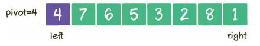
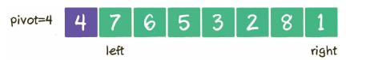
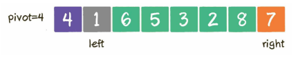
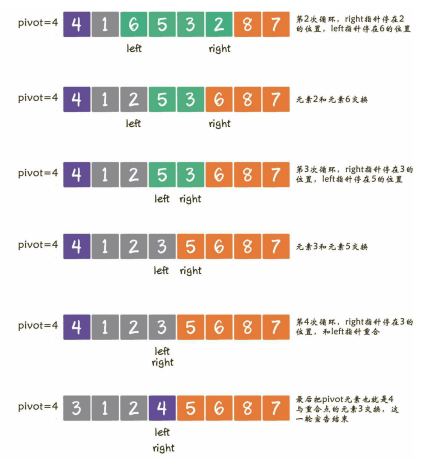
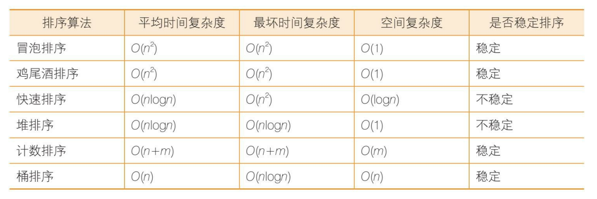

<<<<<<< HEAD
<!--
 * @Author: ZYH
 * @Email: 1522302196@qq.com
 * @GiteeId: colincclala
 * @Date: 2022-04-25 13:18:54
 * @LastEditors: Please set LastEditors
 * @LastEditTime: 2022-04-27 18:07:43
 * @Description: 
 * 
-->
# 排序

1. 时间复杂度为O(n^2)的排序算法
    - 冒泡排序
    - 选择排序
    - 插入排序
    - 希尔排序（希尔排序比较特殊，它的性能略优于O(n^2)，但又比不上O(nlogn)，姑且把它归入本类）

2. 时间复杂度为O(nlogn)的排序算法
    - 快速排序
    - 归并排序
    - 堆排序

3. 时间复杂度为线性的排序算法
    - 计数排序
    - 桶排序
    - 基数排序

- 稳定排序、不稳定排序。

## 冒泡排序
- 相邻的元素**两两比较**，当一个元素大于右侧相邻元素时，交换它们的位置；当一个元素小于或等于右侧相邻元素时，位置不变。

- 优化：
    - 做出标记。数值没有交换，就说明有序，跳出循环。
        ```js
        // 冒泡排序（已优化）
        const bubbleSort2 = arr => {
            const length = arr.length;
            if (length <= 1) return;
            // i < length - 1 是因为外层只需要 length-1 次就排好了，第 length 次比较是多余的。
            for (let i = 0; i < length - 1; i++) {
                let hasChange = false; // 提前退出冒泡循环的标志位
                // j < length - i - 1 是因为内层的 length-i-1 到 length-1 的位置已经排好了，不需要再比较一次。
                for (let j = 0; j < length - i - 1; j++) {
                    if (arr[j] > arr[j + 1]) {
                        const temp = arr[j];
                        arr[j] = arr[j + 1];
                        arr[j + 1] = temp;
                        hasChange = true; // 表示有数据交换
                    }
                }
                if (!hasChange) break; // 如果 false 说明所有元素已经到位，没有数据交换，提前退出
            }
            console.log(arr);
        };
        ```
    - 判断有序区。
        ```js
        function bubbleSortV3(arr) {
            // 记录最后一次交换的位置
            let lastExchangeIndex = 0;
            // 无序数列的边界，每次比较只需要比到此为止
            let sortBorder = arr.length - 1;
            for (let i = 0; i < arr.length - 1; i++) {
                // 有序标记，每一轮都是true
                let isSorted = true;

                for (let j = 0; j < sortBorder; j++) {
                    let temp = 0;
                    if (arr[j] > arr[j + 1]) {
                        let temp = arr[j];
                        arr[j] = arr[j + 1];
                        arr[j + 1] = temp;
                        // 有元素交换，所以不是有序的
                        isSorted = false;
                        lastExchangeIndex = j;
                    }
                }
                sortBorder = lastExchangeIndex;
                if (isSorted) {
                    break;
                }
            }
            console.log(arr);
        }
        ```

- **鸡尾酒排序**(基于冒泡排序的一种升级排序法)
    - 也称*双向冒泡排序*，像钟摆一样，第1轮从左到右，第2轮从右到左，第3轮再从左到右……
    > 鸡尾酒排序更加适合用在*大多数元素已经是有序*的前提下，可以减少排序的回合数。


## 快速排序

- **分治法**，每一轮挑选一个基准元素后，大的放一边小的放一边。
    > 基准元素`pivot`随机选择。


1. 双边循环法
    1. 选定基准元素`pivot`，设置指针`left`数列的最左和`right`数列的最右。
    2. 第一次循环，做比较。如果`right`大于或等于`pivot`，则指针向左移动；如果小于`pivot`，则`right`指针停止移动，切换到`left`指针。
        
    3. 如果`left`小于或等于`pivot`，则指针向右移动；如果大于`pivot`，则`left`指针停止移动。此时left(4)<=pivot(4),所以右移。
        
        
    4. 第二次循环，重新切换到`right`指针，向左移动。`right`指针先移动到8，8>4，继续左移。由于2<4，停止在2的位置。
        

    (MY\DataStructure\Sort\quickSort(DoubleCirculation).js)

2. 单边循环法
    1. 选定基准元素`pivot`。同时，设置一个`mark`指针指向数列起始位置，这个`mark`指针代表小于基准元素的区域边界。
    2. 基准元素的**下一个位置**开始遍历数组。
        - 如果遍历到的元素大于基准元素，就继续往后遍历。
        - 如果遍历到的元素小于基准元素:
            1. `mark`指针右移1位，因为小于`pivot`的区域边界增大了1
            2. 让最新遍历到的元素和`mark`指针所在位置的元素交换位置，因为最新遍历的元素归属于小于`pivot`的区域。

    (MY\DataStructure\Sort\quickSort(SingleCirculation).js)


## 堆排序

- 二叉堆的构建、删除、自我调整等基本操作，正是实现堆排序的基本操作。

- 堆排序算法的步骤。    
    1. **把无序数组构建成二叉堆。需要从小到大排序，则构建成最大堆；需要从大到小排序，则构建成最小堆**。
    2. **循环删除堆顶元素，替换到二叉堆的末尾，调整堆产生新的堆顶**。


## 计数排序

- 数组中每一个下标位置的值代表数列中对应整数出现的次数。

> 适合基数大但是范围小。O(n+k)，牺牲空间换取时间。
    ```js
    function countSort(arr) {
        // 得到数组最大值
        let maxValue = Math.max(...arr); // es6的骚操作
        // 因为数组是从0开始的，我们要记录第n个元素需要创建长度为n+1的数组
        let array = new Array(maxValue + 1).fill(0);
        // 遍历数组，填充技术组
        for (let i = 0; i < arr.length; i++) {
            array[arr[i]] = (array[arr[i]] || 0) + 1;
        }
        let result = [];
        // 把结果push进新数组
        for (let i = 0; i < array.length; i++) {
            let cur = array[i];
            while (cur) {
                result.push(i);
                cur--;
            }
        }
        return result;
    }
    ```

- 优化
    1. 如果最大值99，最小90，创建长度100的数组，就浪费了0-89的空间？
    > 只要不再以*输入数列的最大值+1*作为统计数组的长度，而是以**数列最大值-最小值+1**作为统计数组的长度即可。


    2. 稳定排序？

> 局限性：
> > 1. 当数列最大和最小值差距过大时，并不适合用计数排序。
> > 2. 当数列元素不是整数时，也不适合用计数排序。


## 桶排序

- 每一个桶（bucket）代表一个区间范围，里面可以承载一个或多个元素。


## 小结
=======
<!--
 * @Author: ZYH
 * @Email: 1522302196@qq.com
 * @GiteeId: colincclala
 * @Date: 2022-04-25 13:18:54
 * @LastEditors: Please set LastEditors
 * @LastEditTime: 2022-04-27 18:07:43
 * @Description: 
 * 
-->
# 排序

1. 时间复杂度为O(n^2)的排序算法
    - 冒泡排序
    - 选择排序
    - 插入排序
    - 希尔排序（希尔排序比较特殊，它的性能略优于O(n^2)，但又比不上O(nlogn)，姑且把它归入本类）

2. 时间复杂度为O(nlogn)的排序算法
    - 快速排序
    - 归并排序
    - 堆排序

3. 时间复杂度为线性的排序算法
    - 计数排序
    - 桶排序
    - 基数排序

- 稳定排序、不稳定排序。

## 冒泡排序
- 相邻的元素**两两比较**，当一个元素大于右侧相邻元素时，交换它们的位置；当一个元素小于或等于右侧相邻元素时，位置不变。

- 优化：
    - 做出标记。数值没有交换，就说明有序，跳出循环。
        ```js
        // 冒泡排序（已优化）
        const bubbleSort2 = arr => {
            const length = arr.length;
            if (length <= 1) return;
            // i < length - 1 是因为外层只需要 length-1 次就排好了，第 length 次比较是多余的。
            for (let i = 0; i < length - 1; i++) {
                let hasChange = false; // 提前退出冒泡循环的标志位
                // j < length - i - 1 是因为内层的 length-i-1 到 length-1 的位置已经排好了，不需要再比较一次。
                for (let j = 0; j < length - i - 1; j++) {
                    if (arr[j] > arr[j + 1]) {
                        const temp = arr[j];
                        arr[j] = arr[j + 1];
                        arr[j + 1] = temp;
                        hasChange = true; // 表示有数据交换
                    }
                }
                if (!hasChange) break; // 如果 false 说明所有元素已经到位，没有数据交换，提前退出
            }
            console.log(arr);
        };
        ```
    - 判断有序区。
        ```js
        function bubbleSortV3(arr) {
            // 记录最后一次交换的位置
            let lastExchangeIndex = 0;
            // 无序数列的边界，每次比较只需要比到此为止
            let sortBorder = arr.length - 1;
            for (let i = 0; i < arr.length - 1; i++) {
                // 有序标记，每一轮都是true
                let isSorted = true;

                for (let j = 0; j < sortBorder; j++) {
                    let temp = 0;
                    if (arr[j] > arr[j + 1]) {
                        let temp = arr[j];
                        arr[j] = arr[j + 1];
                        arr[j + 1] = temp;
                        // 有元素交换，所以不是有序的
                        isSorted = false;
                        lastExchangeIndex = j;
                    }
                }
                sortBorder = lastExchangeIndex;
                if (isSorted) {
                    break;
                }
            }
            console.log(arr);
        }
        ```

- **鸡尾酒排序**(基于冒泡排序的一种升级排序法)
    - 也称*双向冒泡排序*，像钟摆一样，第1轮从左到右，第2轮从右到左，第3轮再从左到右……
    > 鸡尾酒排序更加适合用在*大多数元素已经是有序*的前提下，可以减少排序的回合数。


## 快速排序

- **分治法**，每一轮挑选一个基准元素后，大的放一边小的放一边。
    > 基准元素`pivot`随机选择。


1. 双边循环法
    1. 选定基准元素`pivot`，设置指针`left`数列的最左和`right`数列的最右。
    2. 第一次循环，做比较。如果`right`大于或等于`pivot`，则指针向左移动；如果小于`pivot`，则`right`指针停止移动，切换到`left`指针。
        
    3. 如果`left`小于或等于`pivot`，则指针向右移动；如果大于`pivot`，则`left`指针停止移动。此时left(4)<=pivot(4),所以右移。
        
        
    4. 第二次循环，重新切换到`right`指针，向左移动。`right`指针先移动到8，8>4，继续左移。由于2<4，停止在2的位置。
        

    (MY\DataStructure\Sort\quickSort(DoubleCirculation).js)

2. 单边循环法
    1. 选定基准元素`pivot`。同时，设置一个`mark`指针指向数列起始位置，这个`mark`指针代表小于基准元素的区域边界。
    2. 基准元素的**下一个位置**开始遍历数组。
        - 如果遍历到的元素大于基准元素，就继续往后遍历。
        - 如果遍历到的元素小于基准元素:
            1. `mark`指针右移1位，因为小于`pivot`的区域边界增大了1
            2. 让最新遍历到的元素和`mark`指针所在位置的元素交换位置，因为最新遍历的元素归属于小于`pivot`的区域。

    (MY\DataStructure\Sort\quickSort(SingleCirculation).js)


## 堆排序

- 二叉堆的构建、删除、自我调整等基本操作，正是实现堆排序的基本操作。

- 堆排序算法的步骤。    
    1. **把无序数组构建成二叉堆。需要从小到大排序，则构建成最大堆；需要从大到小排序，则构建成最小堆**。
    2. **循环删除堆顶元素，替换到二叉堆的末尾，调整堆产生新的堆顶**。


## 计数排序

- 数组中每一个下标位置的值代表数列中对应整数出现的次数。

> 适合基数大但是范围小。O(n+k)，牺牲空间换取时间。
    ```js
    function countSort(arr) {
        // 得到数组最大值
        let maxValue = Math.max(...arr); // es6的骚操作
        // 因为数组是从0开始的，我们要记录第n个元素需要创建长度为n+1的数组
        let array = new Array(maxValue + 1).fill(0);
        // 遍历数组，填充技术组
        for (let i = 0; i < arr.length; i++) {
            array[arr[i]] = (array[arr[i]] || 0) + 1;
        }
        let result = [];
        // 把结果push进新数组
        for (let i = 0; i < array.length; i++) {
            let cur = array[i];
            while (cur) {
                result.push(i);
                cur--;
            }
        }
        return result;
    }
    ```

- 优化
    1. 如果最大值99，最小90，创建长度100的数组，就浪费了0-89的空间？
    > 只要不再以*输入数列的最大值+1*作为统计数组的长度，而是以**数列最大值-最小值+1**作为统计数组的长度即可。


    2. 稳定排序？

> 局限性：
> > 1. 当数列最大和最小值差距过大时，并不适合用计数排序。
> > 2. 当数列元素不是整数时，也不适合用计数排序。


## 桶排序

- 每一个桶（bucket）代表一个区间范围，里面可以承载一个或多个元素。


## 小结
>>>>>>> 3060b42 (第一次Git提交所有文件)
