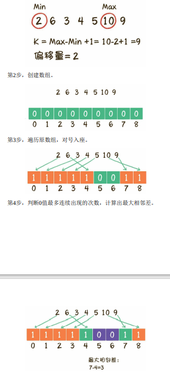
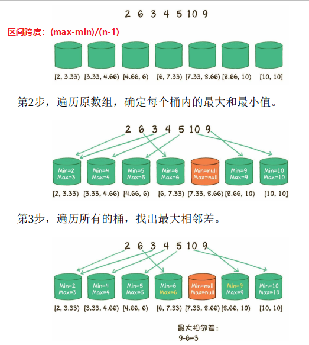

<<<<<<< HEAD
<!--
 * @Author: ZYH
 * @Email: 1522302196@qq.com
 * @GiteeId: colincclala
 * @Date: 2022-05-01 14:14:28
 * @LastEditTime: 2022-05-01 21:06:11
 * @Description: 面试中的算法
 * 
-->
# 面试中的算法


## 一、判断链表有环

1.~~（不推荐）每次遍历一个新节点，都从头检查新节点之前的节点，依次比较，如果相同则有环。时间复杂度O(n^2)，空间复杂度O(1)~~

2. 创建以节点ID为`Key`的`HashSet`集合,储存曾经遍历过的节点。然后依次从头遍历每个节点，与`HashSet`集合中储存的节点比较，如果`HashSet`存在与之相同的节点ID，则有环。时间和空间复杂度O(1)。

3. **快慢指针**，慢指针每次移动一个节点，块指针每次移动两个节点，然后比较两个指针指向的节点是否相同，如果相同则有环。时间复杂度O(n),空间复杂度O(n)。

- 求**环的长度**？
    - 证明有环时，继续循环前进，并且统计循环次数，直到第二次相遇，此时**前进次数就是环长**。

- 求**入环节点**？
    - 证明有环时，慢指针返回头结点，快指针留在相遇处，每个指针前进都只走一步，**直到再次相遇，就是入环节点**。


## 二、最小栈的实现

- 实现一个栈，有出栈（pop）、入栈（push）、取最小栈（getMin）方法，保证都是时间复杂度O(1)。
    - 设置**栈A，栈B**，第一个元素进入两个栈，并设置为最小值，之后每当新元素进入栈A时，比较新元素和栈A里面的最小值，如果小于则让新元素进入栈B，栈B的栈顶元素就是栈A的最小值。如果栈A出栈的是最小值，栈B也出栈。


## 三、求最大公约数

1. **辗转相除法（欧几里得算法）**，两个正整数a和b（a>b），最大公约数==a除以b的余数c和b之间的最大公约数。
    - 例如：计算出a除以b的余数c，转化成求b和c的最大公约数；然后计算出b除以c的余数d，把问题转化成求c和d的最大公约数；再计算出c除以d的余数e，把问题转化成求d和e的最大公约数……
        ```js
        function getGreatestCommon(a,b){
            const big = a>b ? a:b;
            const small = a<b ? a:b;
            if(big%small == 0)return small;
            return getGreatestCommon(big%small,small);
        }
        ```
    > 缺点：整数较大时，a%b取模运算的性能差。

2. **更相减损术**，两个正整数a和b（a>b），最大公约数等于a-b的差值c和b的最大公约数。
    ```js
    function getGreatestCommon(a,b){
        if(a>b)retutn a;
        const big = a>b ? a:b;
        const small = a<b ? a:b;
        return getGreatestCommon(big-small,small);
    }
    ```
    > 缺点：运算次数多。

3. **辗转相除法和更相减损术结合**
    ```js
    // a/2 = a>>1
    function gGCommon(a,b){
        if(a==b)return a;
        // a,b均为偶数
        if((a%1)==0 && (b%1)==0)return gGCommon(a>>1,b>>1)<<1;
        // a为偶，b为奇
        else if((a%1)==0 && (b%1)!=0)return gGCommon(a>>1,b);
        // a为奇，b为偶
        else if((a%1)!=0 && (b%1)==0)return gGCommon(a,b>>1);
        else{
            const big = a>b ? a:b;
            const small = a<b ? a:b;
            return gGCommon(big-small,small);
        }

    }
    ```
    - O(log(max(a,b)))


## 四、判断一个数是否为2的整数次幂

- 实现一个方法，来判断一个正整数是否是2的整数次幂。

| 十进制 | 二进制 | -1 | n&n-1 | 是否为2的整数次幂 |
| :---- | :---- | :---- | :---- | :---- |
| 8 | 1000B | 111B | 0 | 是 |
| 16 | 10000B | 1111B | 0 | 是 |
| 32 | 100000B | 11111B | 0 | 是 |
| 64 | 1000000B | 111111B | 0 | 是 |
| 100 | 1100100B | 1100011B |1100000B | 否 |

- **0和1的桉位运算为0。所以凡是2的整数次幂和它本身减1的结果进行与运算，结果都必定是0**。

    ```js
    function isPowerOf2(num){
        return (num&num-1) == 0;
    }
    ```


## 五、无序数组排序后的最大相邻差

- 有一个无序整型数组，如何求出该数组排序后的任意两个相邻元素的最大差值？
    1. ~~使用O(nlogn)的排序算法，对排好的数组遍历，对每个相邻元素求差。~~

    2. 计数排序。
        

    3. 桶排序。
        


## 六、用栈实现队列

- 用栈来模拟一个队列，要求实现队列的两个基本操作：入队、出队。
    - 创建栈A，栈B。栈A作为队列的入口，负责插入新元素，栈B作为队列的出口，负责移除老元素。
    - 入队：把元素压入栈A。
    - 出队：把栈A中的元素依次出栈，压入栈B中再出栈。出队的前提，栈B先得有元素，没有就去栈A出栈再入栈B再出栈B。
        


## 七、寻找全排列的下一个数

- 给出一个正整数，找出这个正整数所有数字全排列的下一个数。（在一个整数所包含数字的全部组合中，找到一个大于且仅大于原数的新整数。） 

    - 为了和原数接近，尽量**保持高位不变**，**低位在最小的范围内变换顺序**。


    1. 从后向前查看逆序区域，找到逆序区域的前一位，也就是数字置换的边界。
    2. 让逆序区域的前一位和逆序区域中大于它的最小的数字交换位置。
    3. 把原来的逆序区域转为顺序状态 。

        ```js
        var nextPermutation = function (nums) {
            // 找到逆序区域中的前一位
            let index = 0; // 0的话表示已经逆序
            // 逆着来判断是否类似12354的情况
            for (let i = nums.length - 1; i < nums.length; i--) {
                if (i <= 0 || nums[i] > nums[i - 1]) {
                    index = i;
                    break;
                }
            }
            // 如果是0，返回极端数字
            if (!index) {
                nums.reverse();
                return;
            }
            // 将逆序区域中的前一位和逆序区域中的最小数进行交换
            for (let i = nums.length - 1; i < nums.length; i--) {
                if (i <= 0) {
                    break;
                }
                if (nums[i] > nums[index - 1]) {
                    const temp = nums[index - 1];
                    nums[index - 1] = nums[i];
                    nums[i] = temp;
                    // 执行一次就跳出
                    break;
                }
            }
            // 逆序区域中顺序排列
            let i = index, j = nums.length - 1;
            while (j > i) {
                const temp = nums[j];
                nums[j] = nums[i];
                nums[i] = temp;
                i++;
                j--;
            }
            console.log(nums.join(''));
        };
        nextPermutation([1, 2, 3, 5, 4]);
        ```

> 字典序算法，O(n)。


## 八、删去k个数字后的最小值

- 给出一个整数，从该整数中去掉k个数字，要求剩下的数字形成的新整数尽可能小。
    ```js
    function reduceNumber(number, key) {
        let result = [];
        if (key >= number.toString().length) {
            return '0';
        }
        // 把数字分开成数组
        let temp = number.toString().split('');
        for (var i = 0; i < key; i++) {
            let equer = -1; // 默认为-1，也可以是空值或者null
            for (var j = 0; j < temp.length; j++) {
                if (temp[j] >= temp[j + 1]) {
                    equer = j;
                    break; // 每次循环key的时候，找到最后一个左边>=右边的数就跳出循环，这个跟重要
                }
            }
            if (equer >= 0) {
                // 如果符合就切掉
                temp.splice(equer, 1);
            }
        }
        result = temp;
        return result.join('');
    }
    ```
- 贪心算法？stack


## 九、实现大整数相加

- 给出两个很大的整数，要求实现程序求出两个整数之和。
    ```js
    /**
    * @description: 实现大整数相加
    * @param {string} num1
    * @param {string} num2
    * @return {*}
    */
    function largeNumAdd(num1, num2) {
        let maxLength = Math.max(num1.length, num2.length);
        //num1和num2位数对齐，位数较小的前面补0
        // padStart()用于头部补全
        num1 = num1.padStart(maxLength, '0');
        num2 = num2.padStart(maxLength, '0');
        let res = '';//存放最后得到的结果
        let figure = 0;//figure = 两个数字对应位数数值相加 + 进位
        let currentNum = 0;//对应位数的结果
        let carry = 0;//进位
        for (let i = num1.length - 1; i >= 0; i--) {
            figure = parseInt(num1[i]) + parseInt(num2[i]) + carry;
            currentNum = figure % 10;
            carry = Math.floor(figure / 10);
            res = currentNum + res;
        }
        console.log(res);
    }
    ```


## 十、求解金矿问题

- ***动态规划***

- 很久很久以前，有一位国王拥有5座金矿，每座金矿的黄金储量不同，需要参与挖掘的工人人数也不同。


## 十一、寻找缺失的整数
=======
<!--
 * @Author: ZYH
 * @Email: 1522302196@qq.com
 * @GiteeId: colincclala
 * @Date: 2022-05-01 14:14:28
 * @LastEditTime: 2022-05-01 21:06:11
 * @Description: 面试中的算法
 * 
-->
# 面试中的算法


## 一、判断链表有环

1.~~（不推荐）每次遍历一个新节点，都从头检查新节点之前的节点，依次比较，如果相同则有环。时间复杂度O(n^2)，空间复杂度O(1)~~

2. 创建以节点ID为`Key`的`HashSet`集合,储存曾经遍历过的节点。然后依次从头遍历每个节点，与`HashSet`集合中储存的节点比较，如果`HashSet`存在与之相同的节点ID，则有环。时间和空间复杂度O(1)。

3. **快慢指针**，慢指针每次移动一个节点，块指针每次移动两个节点，然后比较两个指针指向的节点是否相同，如果相同则有环。时间复杂度O(n),空间复杂度O(n)。

- 求**环的长度**？
    - 证明有环时，继续循环前进，并且统计循环次数，直到第二次相遇，此时**前进次数就是环长**。

- 求**入环节点**？
    - 证明有环时，慢指针返回头结点，快指针留在相遇处，每个指针前进都只走一步，**直到再次相遇，就是入环节点**。


## 二、最小栈的实现

- 实现一个栈，有出栈（pop）、入栈（push）、取最小栈（getMin）方法，保证都是时间复杂度O(1)。
    - 设置**栈A，栈B**，第一个元素进入两个栈，并设置为最小值，之后每当新元素进入栈A时，比较新元素和栈A里面的最小值，如果小于则让新元素进入栈B，栈B的栈顶元素就是栈A的最小值。如果栈A出栈的是最小值，栈B也出栈。


## 三、求最大公约数

1. **辗转相除法（欧几里得算法）**，两个正整数a和b（a>b），最大公约数==a除以b的余数c和b之间的最大公约数。
    - 例如：计算出a除以b的余数c，转化成求b和c的最大公约数；然后计算出b除以c的余数d，把问题转化成求c和d的最大公约数；再计算出c除以d的余数e，把问题转化成求d和e的最大公约数……
        ```js
        function getGreatestCommon(a,b){
            const big = a>b ? a:b;
            const small = a<b ? a:b;
            if(big%small == 0)return small;
            return getGreatestCommon(big%small,small);
        }
        ```
    > 缺点：整数较大时，a%b取模运算的性能差。

2. **更相减损术**，两个正整数a和b（a>b），最大公约数等于a-b的差值c和b的最大公约数。
    ```js
    function getGreatestCommon(a,b){
        if(a>b)retutn a;
        const big = a>b ? a:b;
        const small = a<b ? a:b;
        return getGreatestCommon(big-small,small);
    }
    ```
    > 缺点：运算次数多。

3. **辗转相除法和更相减损术结合**
    ```js
    // a/2 = a>>1
    function gGCommon(a,b){
        if(a==b)return a;
        // a,b均为偶数
        if((a%1)==0 && (b%1)==0)return gGCommon(a>>1,b>>1)<<1;
        // a为偶，b为奇
        else if((a%1)==0 && (b%1)!=0)return gGCommon(a>>1,b);
        // a为奇，b为偶
        else if((a%1)!=0 && (b%1)==0)return gGCommon(a,b>>1);
        else{
            const big = a>b ? a:b;
            const small = a<b ? a:b;
            return gGCommon(big-small,small);
        }

    }
    ```
    - O(log(max(a,b)))


## 四、判断一个数是否为2的整数次幂

- 实现一个方法，来判断一个正整数是否是2的整数次幂。

| 十进制 | 二进制 | -1 | n&n-1 | 是否为2的整数次幂 |
| :---- | :---- | :---- | :---- | :---- |
| 8 | 1000B | 111B | 0 | 是 |
| 16 | 10000B | 1111B | 0 | 是 |
| 32 | 100000B | 11111B | 0 | 是 |
| 64 | 1000000B | 111111B | 0 | 是 |
| 100 | 1100100B | 1100011B |1100000B | 否 |

- **0和1的桉位运算为0。所以凡是2的整数次幂和它本身减1的结果进行与运算，结果都必定是0**。

    ```js
    function isPowerOf2(num){
        return (num&num-1) == 0;
    }
    ```


## 五、无序数组排序后的最大相邻差

- 有一个无序整型数组，如何求出该数组排序后的任意两个相邻元素的最大差值？
    1. ~~使用O(nlogn)的排序算法，对排好的数组遍历，对每个相邻元素求差。~~

    2. 计数排序。
        

    3. 桶排序。
        


## 六、用栈实现队列

- 用栈来模拟一个队列，要求实现队列的两个基本操作：入队、出队。
    - 创建栈A，栈B。栈A作为队列的入口，负责插入新元素，栈B作为队列的出口，负责移除老元素。
    - 入队：把元素压入栈A。
    - 出队：把栈A中的元素依次出栈，压入栈B中再出栈。出队的前提，栈B先得有元素，没有就去栈A出栈再入栈B再出栈B。
        


## 七、寻找全排列的下一个数

- 给出一个正整数，找出这个正整数所有数字全排列的下一个数。（在一个整数所包含数字的全部组合中，找到一个大于且仅大于原数的新整数。） 

    - 为了和原数接近，尽量**保持高位不变**，**低位在最小的范围内变换顺序**。


    1. 从后向前查看逆序区域，找到逆序区域的前一位，也就是数字置换的边界。
    2. 让逆序区域的前一位和逆序区域中大于它的最小的数字交换位置。
    3. 把原来的逆序区域转为顺序状态 。

        ```js
        var nextPermutation = function (nums) {
            // 找到逆序区域中的前一位
            let index = 0; // 0的话表示已经逆序
            // 逆着来判断是否类似12354的情况
            for (let i = nums.length - 1; i < nums.length; i--) {
                if (i <= 0 || nums[i] > nums[i - 1]) {
                    index = i;
                    break;
                }
            }
            // 如果是0，返回极端数字
            if (!index) {
                nums.reverse();
                return;
            }
            // 将逆序区域中的前一位和逆序区域中的最小数进行交换
            for (let i = nums.length - 1; i < nums.length; i--) {
                if (i <= 0) {
                    break;
                }
                if (nums[i] > nums[index - 1]) {
                    const temp = nums[index - 1];
                    nums[index - 1] = nums[i];
                    nums[i] = temp;
                    // 执行一次就跳出
                    break;
                }
            }
            // 逆序区域中顺序排列
            let i = index, j = nums.length - 1;
            while (j > i) {
                const temp = nums[j];
                nums[j] = nums[i];
                nums[i] = temp;
                i++;
                j--;
            }
            console.log(nums.join(''));
        };
        nextPermutation([1, 2, 3, 5, 4]);
        ```

> 字典序算法，O(n)。


## 八、删去k个数字后的最小值

- 给出一个整数，从该整数中去掉k个数字，要求剩下的数字形成的新整数尽可能小。
    ```js
    function reduceNumber(number, key) {
        let result = [];
        if (key >= number.toString().length) {
            return '0';
        }
        // 把数字分开成数组
        let temp = number.toString().split('');
        for (var i = 0; i < key; i++) {
            let equer = -1; // 默认为-1，也可以是空值或者null
            for (var j = 0; j < temp.length; j++) {
                if (temp[j] >= temp[j + 1]) {
                    equer = j;
                    break; // 每次循环key的时候，找到最后一个左边>=右边的数就跳出循环，这个跟重要
                }
            }
            if (equer >= 0) {
                // 如果符合就切掉
                temp.splice(equer, 1);
            }
        }
        result = temp;
        return result.join('');
    }
    ```
- 贪心算法？stack


## 九、实现大整数相加

- 给出两个很大的整数，要求实现程序求出两个整数之和。
    ```js
    /**
    * @description: 实现大整数相加
    * @param {string} num1
    * @param {string} num2
    * @return {*}
    */
    function largeNumAdd(num1, num2) {
        let maxLength = Math.max(num1.length, num2.length);
        //num1和num2位数对齐，位数较小的前面补0
        // padStart()用于头部补全
        num1 = num1.padStart(maxLength, '0');
        num2 = num2.padStart(maxLength, '0');
        let res = '';//存放最后得到的结果
        let figure = 0;//figure = 两个数字对应位数数值相加 + 进位
        let currentNum = 0;//对应位数的结果
        let carry = 0;//进位
        for (let i = num1.length - 1; i >= 0; i--) {
            figure = parseInt(num1[i]) + parseInt(num2[i]) + carry;
            currentNum = figure % 10;
            carry = Math.floor(figure / 10);
            res = currentNum + res;
        }
        console.log(res);
    }
    ```


## 十、求解金矿问题

- ***动态规划***

- 很久很久以前，有一位国王拥有5座金矿，每座金矿的黄金储量不同，需要参与挖掘的工人人数也不同。


## 十一、寻找缺失的整数
>>>>>>> 3060b42 (第一次Git提交所有文件)
