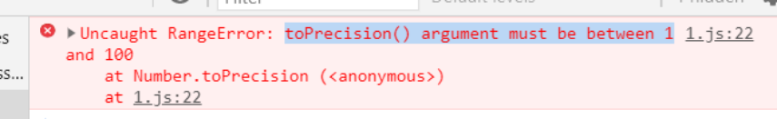

# 方法

## Array

### array.concat(item...)

- ***concat***方法返回一个新数组，包含array的浅复制并将一个或多个参数item附加在其后。
    > 如果参数item是一个数组，那它的每个元素会被分别添加。
    ```
    var a = ['a','b','c'];
    var b = ['x','y','z'];
    var c = a.concat(b,true);
    // c是['a','b','c','x','y','z',true]
    ```


### array.join(separator)

- ***join***方法把一个array构造成一个字符串。将array中的每个元素构成一个字符串，并用separator为分隔符连接在一起。
    > 默认的separator是','。
    ```
    var a = ['a','b','c'];
    var c = a.join();  
    //c是a,b,c
    ```


### array.pop()

- ***pop和push***向堆栈一样工作。pop是移除数组中最后一个元素并返回该元素。
    > 如果array为空，则返回undefined。
    ```
    var a = ['a','b','c'];
    var c = a.pop();
    //a是['a','b']   c是'c'
    ```


### array.push(item..)

- ***push***是把一个或者多个参数item附加到一个数组的尾部。
    > 与concat方法不同，如果item是一个数组，则将数组作为整个单位添加到数组中。返回array的***新长度***。
    ```
    var a = ['a','b','c'];
    var b = ['x','y','z'];
    var c = a.push(b,true);
    // a是['a','b','c', ['x','y','z'] ,true]
    // c是 5
    ```


### array.reverse()

- ***reverse***反转array中元素的顺序。


### array.shift()

- ***shift***方法移除数组中的第一个元素并返回该元素
    > 如果array是空的，则返回undefined。
    ```
    var a = ['a','b','c'];
    var c = a.shift();
    // a是 ['b','c']
    // c是 'a'
    ```


### array.slice(start,end)

- ***slice***对array做一段浅复制，从start开始到end结束。
    1. 如果俩个参数中任何一个是负数，array.length将和他们相加来试图使他们成为非负数。
    2. 如果start >= array.length，得到的的结果将是一个新的空数组。
    ```
    var a = ['a','b','c'];
    var b = a.slice(0,1);  // b是['a']
    var c = a.slice(1);    // c是['b','c']
    var d = a.slice(1,2);  // d是['b']
    var e = a.slice(0,-2);  // e是['a'] -2+3=1
    var f = a.slice();   //f是['a','b','c']
    ```


### array.sort(comparefn)

- ***sort***方法对array中的内容进行适当的排序。 
    > 不能正确地给出一组数字排序
    ```
    var n=[4,8,15,23,42];  
    n.sort();  
    //n是[15,16,23,4,42,8]
    ```
    - **出现问题的原因**是JavaScript中*默认比较函数*会把被排序的元素都视为字符串；  
    - **解决方案**：可以使用自己的比较函数来替换默认的比较函数。比较函数应该接受两个参数，并且如果这两个参数相等则返回0，*如果第一个参数应该排序在前面，则返回一个负数。如果第二个参数应该排列在最前面，则返回一个正数*。
        ```
        var n=[4,8,15,23,42];  
        n.sort(function(a,b){  
            return a-b;  
        }
        //n是[4,8,15,16,23,42]  
        ```
        * 上述方法可以使得数字正确排序，但是不能使得字符串排序。
        ```
        var m=['aa','bb','a',4,8,15,16,23,42];  
        m.sort(function(a,b){
            if(a===b) 
                return 0;  
            }  
            if(typrof a===typeof b){  
                return a<b?-1:1;  
        });  
        //m是[4,8,15,16,23,42,'a','aa','bb']  
        ```


### array.splice(start,deleteCount,item…)

- ***aplice***方法从array中*移除*1个或多个元素，并用新的item替换他们。参数start是从数组array中移除元素的开始位置。参数deleteCount是要移除的元素个数。如果有额外的参数，item会插入到被移除的元素位置上，它**返回一个包含被移除元素的数组**。
    > 注意：区分splice和slice，slice是从start到end的浅复制
    ```
    var a=['a','b','c'];
    var r=a.splice(1,1,'ache','bug');
    //a是['a','ache','bug','c']
    //r是['b']
    ```


### array.unshift(item…)

- ***unshift***方法像push一样添加新元素，但它把item插入array的开始部分，而非尾部。
    > 返回array新的长度。
    ```
    var a=['a','b','c'];
    var r=a.unshift('?','@');
    //a是['?','@','a','b','c']
    //r是5
    ```


## Function

### function.apply(thisArg,argArray)

- ***apply***方法调用function，传递一个会被绑定到this上的对象和一个可选的数据作为参数。第四章


## Number

### number.toExponential(fractionDigits)

- ***toExponential***方法把number转换成一个指数形式的字符串。
    > 可选参数fractionDigits控制其小数点后的数字位数，在0-20之间。
    ```
    document.writeln(Math.PI.toExponential(0));
    document.writeln(Math.PI.toExponential(2));
    document.writeln(Math.PI.toExponential(16));
    document.writeln(Math.PI.toExponential()); //15位
    //3e+0
    //3.14e+0
    //3.1415926535897930e+0
    //3.141592653589793e+0
    ```


### number.toFixed(fractionDigits)

- ***toFixed***方法把number转换成一个十进制数形式的字符串。
    > 可选fractionDigits来控制其小数点后的数字位数，在0-20之间。默认0。
    ```
    document.writeln(Math.PI.toFixed(0));
    document.writeln(Math.PI.toFixed(2));
    document.writeln(Math.PI.toFixed());
    //3
    //3.14
    //3
    ```


### number.toPrecision(precision)

- ***toPrecision***方法把number转换成一个十进制数形式的字符串。
    > 可选参数precision来控制数字的精度，在1-100之间。(书上有错误0-21)
    
    ```
    document.writeln(Math.PI.toPrecision(2));
    //3.1
    ```


### number.toString(radix)

- ***toString***方法把number转换成一个字符串。普通情况下，number.toString()可以写成String(number)
    > 可选参数radix来控制基数，值必须在2~36之间，默认的radix是以10为基数的。
    ```
    document.writeln(Math.PI.toString(8));
    document.writeln(Math.PI.toString());
    //3.11103755242102643
    //3.141592653589793
    ```


## Object

### object.hasOwnProperty(name)

- 若***object***包含一个名为 name的属性，hasOwnProperty方法返回true。
    > 原型链中的同名属性不会被检查。
    ```
    var a = {member:true};
    var b = Object.beget(a);
    var t = a.hasOwnProperty('member');   //true
    var u = b.hasOwnProperty('member');   //false
    var v = b.member;          //true
    ```


## RegExp


### regexp.exec(string)

- ***exec***方法使用正则表达式的**最强大和最慢**的方法。如果成功匹配regexp和字符串string，它返回一个数组。数组中下标为0的元素将包含正则表达式regexp匹配子字符串。下标为1的元素是分组1捕获的文本，下标为2的元素是分组2捕获的文本，如果匹配失败返回null。
    > 如果带有g标识，查找不是从这个字符串的起始位置开始，而是从regexp.lastIndex初始化为0的位置开始。匹配成功，则regexp.lastIndex被设置为该匹配后第一个字符的位置。不成功，重置regexp.lastIndex为0。

    ？？？


### regexp.test(string)

- ***test***方法使用正则表达式的**最简单和最快**的方法。如果***regexp***匹配string，它返回true，否则返回false。
    > 不要对这个方法使用g标识。
    ```
    var b = /&.+;/.test('frank &amp; beans');   //true
    ```


## String


### string.charAt(pos)

- ***charAt***方法返回在string中pos位置处的字符。
    > 若pos小于0或者大于等于字符串的长度string.length,它会返回空字符串。
    ```
    var name = 'Curly';
    var initial = name.charAt(0);  // 'C'
    ```


### string.charCodeAt(pos)

- ***charCodeAt***与charAt方法一样，只是它返回的不是一个字符串，而是以整数形式表示的在string中的pos位置处的字符的*字符码位*。
    > 若pos小于0或者大于等于字符串的长度string.length,它会返回NaN。
    ```
    var name='curly';
    var initial=name.charAt(0); 
    var initial1=name.charCodeAt(0);
    //initial是'c'
    //initial1是67
    ```


### string.concat(string)（不常用, + 运算符更方便）

- ***concat***把其他的字符串连接在一起来构造一个新的字符串
    ```
    var s = 'C'.concat('a','t');   //s是'Cat'
    ```


### string.indexOf(searchString,position)

- ***indexOf***方法在string内查找另一个字符串searchString，若找到，返回第一个匹配字符的位置，否则返回-1
    ```
    var text = 'Mississippi';
    var p = text.indexOf('ss');   // p是2
    p = text.indexOf('ss',3);    // p是5
    p = text.indexOf('ss',6);    // p是-1
    ```


### string.lastIndexOf(searchString,position)

- ***lastIndexOf***和indexOf方法类似，只是从字符串的尾部开始查找，若找到，返回第一个匹配字符的位置，否则返回-1。
    ```
    var text='Mississippi';
    var p=text.indexOf('ss');//p是2
    p=text.indexOf('ss',3);//p是5

    var q=text.lastIndexOf('ss');//q是5
    q=text.lastIndexOf('ss',3);//q是2
    ```


### string.localeCompare(that)

- ***localeCompare***比较两个字符串。如果string比字符串that小，结果为负数，如果相等结果为0。


### string.match(regexp)

- ***match***方法让字符串和一个正则表达式进行匹配。它依据g标识来决定如何进行匹配。如果没有g标识，则调用string.match(regexp)结果与调用regexp.exec(string)的结果相同。若有g标识，则生成一个包含所有匹配的数组


### string.replace(searchValue,replaceValue)

- ***replace***方法对string进行查找和替换操作，并返回一个新的字符串。参数searchValue可以是一个字符串或者一个正则表达式对象。replaceValue是一个字符串或者一个函数。
     > 如果searchValue是一个带着g标志的正则表达式，那么将替换所有匹配之处；否则只替换第一个匹配之处。
     ```
     var result = "mother_in_law".replace('_','-');  //"mother-in_law"
     ```
     > 如果searchValue是一个字符串，$有特别的含义。
     ```
     var a = /\((\d{3})\)/g;
     var p = '(555)666-1212'.replace(a,'$1-');
     // p是'555-666-1212'
     ```
        * $$ ：$
        * $& ：整个匹配的文本
        * $number ：分组捕获的文本
        * $` ：匹配之前的文本
        * $' ：匹配之后的文本


### string.search(regexp)

- ***search***方法与indexOf方法类似，只接受一个正则表达式作为参数而不是一个字符串。若匹配成功，返回**第一个匹配的首字符位置**，如果没有找到匹配，返回-1。
    > 此方法忽略g标志


### string.slice(start,end)

- ***slice***方法复制string的一部分来构造一个新的字符串。
    > 如果start/end参数是负数，它将与string.length相加。end参数可选，且默认值是.length。
    ```
    var text='and in it he says "Any damn fool could';
    var a=text.slice(18);
    //a是'"Any damn fool could'
    var b=text.slice(0,3);
    //b是'and'
    var c=text.slice(-5);
    //c是'could'
    ```


### string.split(separator,limit)

- ***split***方法把这个string分割成片段来创建一个字符串数组。
    > separator可以是一个字符串或者一个正则表达式。如果为空，返回一个单字符的数组。此方法忽略g标志。


### string.substring(start,end)（用slice代替）

- 和slice一样，只是不能处理负数。


### string.toLocateLowerCase()

- ***toLocateLowerCase***将字符串字母转换为小写


### string.toLocateUpperCase()

- ***toLocateUpperCase***将字符串字母转换为大写


### string.toLowerCase()

- ***toLowerCase***将字符串字母转换为小写


### string.toUpperCase()

- ***toUpperCase***将字符串字母转换为大写

### string.fromCharCode(char…)

- ***fromChar***根据一串数字编码返回一个字符串。
    ```
    var a = String.fromCharCode(67,97,116);
    // a是'Cat'
    ```
