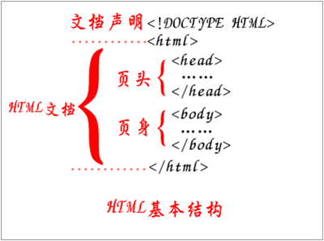

# html学习
## 基础总结
1. HTML基本结构：  
    
2. 前端技术核心元素的是HTML、CSS和JavaScript，但是还要学习一些Ajax、SEO知识；
3. 后端技术有ASP.NET（或PHP）、SQL Server等；

## 基本标签
- head标签  
    代表页面的“头”，定义一些特殊内容，这些内容往往都是“不可见内容”（在浏览器不可见）。
    > title: 	定义网页的标题  
    > meta:     定义网页的基本信息（供搜索引擎）  
    > style:    定义CSS样式  
    > link:	    链接外部CSS文件或脚本文件  
    > script:	定义脚本语言  
    > base: 	定义页面所有链接的基础定位（用得很少）  
- body标签  
    代表页面的“身”，定义网页展示内容，这些内容往往都是“可见内容”（在浏览器可见）